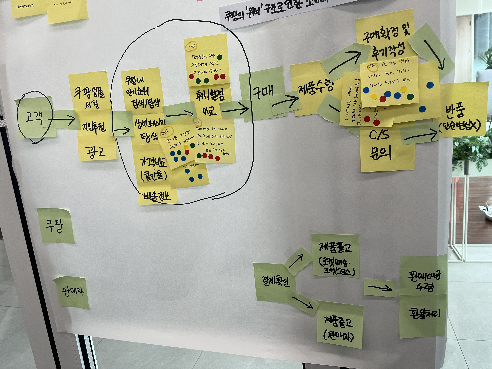
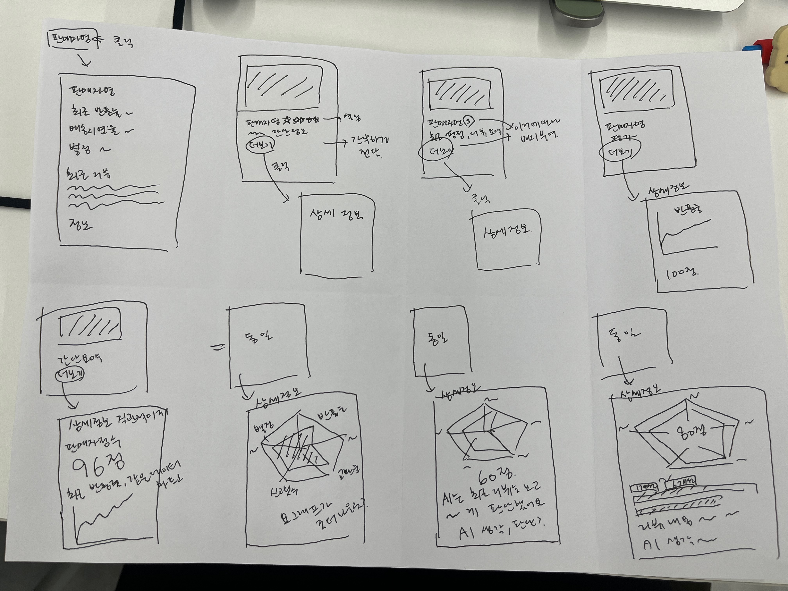

[강동7기 전Z전능 AI PM] 코멘토 청년취업사관학교 DAY 03

---

## DAY 03 | 디자인 스프린트 Day 2 — 여정 지도와 솔루션 스케치

오늘은 어제 정의한 문제를 바탕으로 사용자 여정을 그리고, 다른 서비스 사례를 탐색한 뒤 직접 솔루션을 스케치해보는 날이었다. 막연했던 아이디어가 손으로 그리면서 구체화되는 게 신기했다.

---

### 사용자 여정 지도 그리기

장기 목표와 스프린트 질문을 해결하기 위해, 고객이 서비스를 경험하는 흐름을 처음부터 끝까지 그려보는 단계. 이 과정을 통해 어디에 집중해서 문제를 풀지 타겟을 좁히게 된다.

**타겟 설정**

| 항목      | 내용                |
| --------- | ------------------- |
| 타겟 고객 | 쿠팡 유저 (고객)    |
| 사건      | 구매 제품 탐색 과정 |

---

### 번개 스케치 데모 — 사례 탐색

솔루션 도출을 위해 기존 아이디어와 사례를 탐색하고 제안하는 단계. 단순 모방이 아니라, 배울 만한 장점을 찾아 조합하고 개선해 우리 아이디어로 발전시키는 게 핵심이다.

**당근 — 매너온도**

- 핵심: 신규 가입자는 36.5도로 시작, 거래 상대방 평가에 따라 변동되는 신뢰 수치
- 유용한 이유: 복잡한 데이터(거래 건수, 신고 이력 등)를 숫자로 직관화

**에어비앤비, G마켓 — 슈퍼호스트 배지**

- 핵심: 평점·응답률·취소율 등 여러 기준을 충족한 호스트에게만 부여되는 배지, 검색 결과에서 강조 표시
- 유용한 이유: 판매자 등급을 정량적 기준으로 자동 산출하고 배지화한 사례

**아마존 — 바이 박스 시스템 + 셀러 프로필 페이지**

- 핵심: ① 자격 미달 판매자는 "장바구니 담기" 버튼이 사라짐(주문 결함률, 배송 지연율로 판단) ② 판매자명 클릭 시 셀러 프로필로 이동, 독립적인 평점 확인 가능
- 유용한 이유: ① 신뢰 미달 판매자 자동 강등 패널티 ② 판매자 정보와 리뷰를 상세 확인 가능

**네이버지도 — 키워드 리뷰**

- 핵심: 키워드 위주의 상점 리뷰 시스템을 유저에게 공개하는 방식으로 변경
- 유용한 이유: 기존에 복잡하거나 불가했던 키워드 위주 피드백을 공개·도식화해 상점 평가가 한눈에 들어오도록 개선

---

### 4단계 스케치

솔루션을 구체화하는 단계는 4단계로 나뉜다.

1. **메모** — 주요 정보 수집
2. **아이디어** — 개략적인 솔루션 끼적거려 보기
3. **크레이지 에이트** — 신속하게 변형해보기
4. **솔루션 스케치** — 세부 사항 만들기

쿠팡에서 판매자 정보를 투명하고 직관적으로 보여주기 위한 솔루션을 스케치해봤다.

- 제품 상세 페이지에서 대략적인 판매자 정보를 보여주고, '더보기' 버튼을 누르면 판매자 정보 상세 페이지로 이동
- 상세 페이지에서는 차트로 종합 평가 점수를 직관적으로 보여주고, 하단에는 기간별 필터링으로 별점별 리뷰를 확인 가능
- 그 하단에는 AI가 리뷰를 종합·요약해서 보여주는 영역도 추가

---

### 오늘의 한 줄

사례 탐색을 하면서 느낀 건, 좋은 신뢰 UX는 결국 "복잡한 데이터를 얼마나 직관적으로 숫자나 시각 정보로 바꾸는가"에 달려 있다는 것. 매너온도, 슈퍼호스트 배지, 바이 박스 모두 본질은 같았다.

---

#취업 #부트캠프 #청년취업사관학교 #새싹 #AIPM #DX교육 #AI교육 #실무프로젝트 #실무경험 #취업포트폴리오 #포트폴리오 #전Z전능 #코멘토 #모비니티
