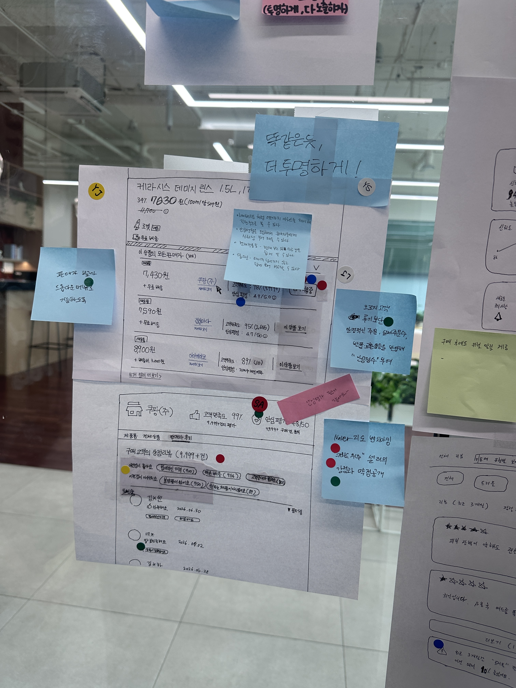
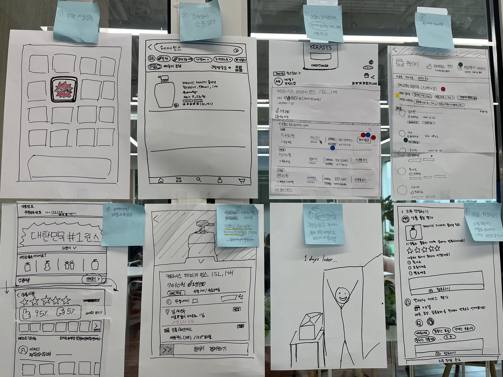

x---
title: "[강동7기 전Z전능 AI PM] 코멘토 청년취업사관학교 DAY 04"
date: 2026-07-01

---

[강동7기 전Z전능 AI PM] 코멘토 청년취업사관학교 DAY 04

---

## DAY 04 | 디자인 스프린트 Day 3 — 솔루션 결정과 솔루션 시각화

오늘은 스케치한 솔루션들을 빠르게 평가 및 비판하여 최종 솔루션을 결정하는 시간을 가졌다. 이후 결정된 아이디어를 바탕으로 사용자 테스트 플로우를 설계하고 스토리보드로 시각화하는 과정까지 진행하며 아이디어를 구체화했다.

---

### 솔루션 결정

**스케치한 솔루션들을 빠르게 평가하고, 비판하고 결정합니다.**

#### 미술관

1. 개별 솔루션 스케치들을 벽면에 나란히 잘 보이도록 붙이세요.
2. 마치 미술관에 온 것처럼, 조용하고 존중하는 마음으로 하나하나를 살펴보세요.

#### 히트맵 투표

히트맵은 팀의 관심이 어디에 모이는지 투표를 통해 시각적으로 확인하는 과정입니다.

실제 회의에선 말을 잘하거나 영향력 있는 사람의 의견에 끌리기 쉬워요. 그래서 아이디어보다 '누가 말했는가'에 따라 판단이 흐려질 수 있습니다. **히트맵은 아이디어 자체만 보고 판단할 수 있는 환경을 만들어줍니다**. 설명 없이 스케치를 먼저 보고 평가하면, 고객의 첫인상과 더 비슷한 반응을 끌어낼 수 있어요. 실제 제품 앞엔 설명해줄 사람이 없으니, 스케치도 설명 없이 혼자 서야 합니다.

#### 솔루션 검토

팀원들의 관심과 기대가 집중된 아이디어를 하나씩 해설하고 공유하는 시간이다.

우리 팀이 선택한 솔루션은 **'똑같은 듯, 더 투명하게'** 라는 타이틀을 가진 스케치였다. 기존 쿠팡 UI를 해치지 않으면서 "가격 중점으로 보는 아이템 위너 시스템의 한계를 극복할 수 있을까?"라는 스프린트 질문을 해결할 수 있다는 의견으로 최종 결정되었다.

#### 여론조사

의사결정자를 제외한 팀원들이 모두 함께 동시에 스티커를 붙여 투표를 진행하는 과정이다. 의사결정자가 올바른 결정을 내릴 수 있도록 정보를 주는 것은 팀 모두의 책임이다.

#### 결정권자 투표

팀원들이 돌아가며 자신이 선택한 이유를 1분씩 설명한 뒤, **결정권자가 2개의 큰 점 스티커를 사용해 최종 결정**을 내린다. 하나는 최종 선택한 솔루션에, 다른 하나는 추가하고 싶은 기능이나 요소에 부여하여 방향성을 확정하게 된다.

---

### 솔루션 시각화

결정된 솔루션을 처음부터 완벽하게 만들기보다, 최소한의 버전인 **간단한 프로토타입(MVP)으로 만들어 사용자에게 빠르게 검증**하는 것이 시각화의 목표다.

#### 사용자 테스트 플로우 설계

화면 설계나 세부사항을 정하기 전에, **사용자가 처음부터 끝까지 솔루션을 어떻게 경험할지 흐름을 정리**하는 과정이다. 테스트의 핵심이 되는 흐름이 누락되거나 중복되지 않도록 도와준다.

우리 팀은 다음과 같은 6단계 플로우를 설계했다.

1. 쿠팡 앱 접속
2. 검색창에 상품 검색
3. 상품 상세 정보 확인 — 판매자가 여러 명이라는 정보를 상단에 노출하고, 각 판매자의 신뢰도를 함께 보여준다
4. 가격뿐 아니라 신뢰도 데이터를 종합해 선별된 판매자의 제품을 장바구니에 담는다
5. 원터치 결제로 주문 후 판매자 혹은 쿠팡 배송으로 제품 수령
6. 주문 확정 후 리뷰 작성 — 제품과 판매자에 대한 평가를 각각 남긴다

#### 스토리보드 작성

전지에 8칸 정도의 격자판을 그리고, **선택된 사용자 테스트 플로우에 맞게 포스트잇을 넣어 배치**한다. 새로운 그림을 그리기보다 이미 나온 스케치와 아이디어를 최대한 재활용하여 빠르게 프로토타입 제작에 집중해야 한다. 더 이상 추가 질문이 나오지 않도록 흐름과 기능을 명확하게 작성하는 것이 중요하다.

---

### 오늘의 한 줄

말이나 직급의 영향력에서 벗어나 오직 아이디어만으로 평가받는 '히트맵 투표'와, 최소한의 기능으로 빠르게 사용자 검증을 준비하는 '사용자 테스트 플로우' 설계 과정이 인상 깊었다. 막연한 솔루션이 스토리보드 위에 시각화되면서, 우리 제품이 어떻게 작동할지 확신을 갖게 된 뜻깊은 시간이었다.

---

#취업 #부트캠프 #청년취업사관학교 #새싹 #AIPM #DX교육 #AI교육 #실무프로젝트 #실무경험 #취업포트폴리오 #포트폴리오 #전Z전능 #코멘토 #모비니티
