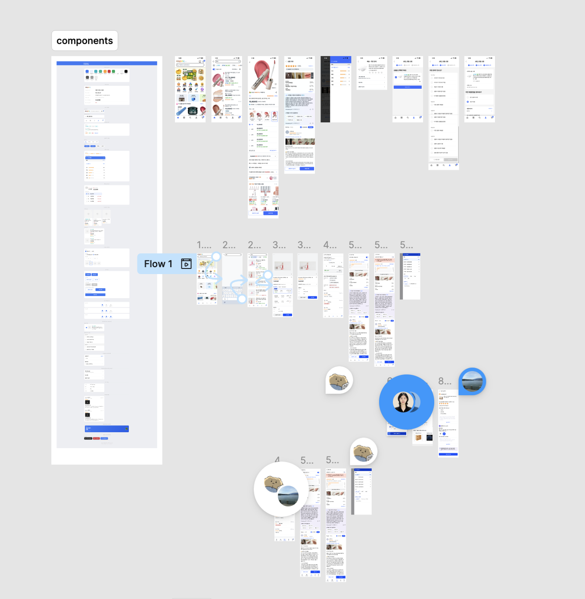

[강동7기 전Z전능 AI PM] 코멘토 청년취업사관학교 DAY 05

---

## DAY 05 | 디자인 스프린트 Day 4 — 프로토타입 제작과 인터뷰 준비

오늘은 어제 결정한 솔루션을 바탕으로 프로토타입을 만들고, 내일 고객 인터뷰를 위한 준비를 시작하는 날이었다.

---

### 프로토타입 제작의 핵심 원칙

프로토타입은 완성된 제품이 아니라 아이디어를 검증하기 위한 실험 도구다.

- **진짜 같은 가짜**: 백엔드가 없어도 사용자가 진짜라고 느낄 수 있으면 충분하다
- **골디락스 품질**: 너무 낮으면 신뢰할 수 없는 피드백이 오고, 너무 높으면 하루 안에 못 만든다. 딱 적당한 품질이 핵심이다
- **버릴 준비**: 애정을 너무 많이 쏟으면 부정적인 피드백을 받았을 때 수정하기 힘들어진다

---

### AI 도구, 프롬프트가 퀄리티를 결정한다

Google Stitch를 처음 써봤는데, 애매하게 전달하면 원하는 화면이 안 나왔다. 막연하게 "쿠팡 스타일 앱 만들어줘" 수준으로 입력하면 원하는 결과물과 거리가 멀었다.

그래서 Stitch에 바로 입력하는 대신, 먼저 클로드에게 우리가 해결하려는 핵심 문제, 화면별 요구사항, 참고할 스토리보드 내용을 전달해서 프롬프트를 먼저 정리했다. 그렇게 다듬어진 프롬프트를 Stitch에 넣었더니 초안 퀄리티가 눈에 띄게 달라졌다.

UI 초안 제작 속도가 빨라지는데, 그 전제가 "무엇을 만들어야 하는지 내가 먼저 명확하게 알고 있어야 한다"는 거였다. 프롬프트를 잘 쓰는 것도 결국 문제 정의 능력이라는 생각이 들었다.

> [!note]- 실제 사용한 프롬프트
> 첨부한 스토리보드 이미지를 참고해서, 각 화면의 흐름과 화면별 핵심 요소를 반영한
> 쿠팡 스타일 이커머스 앱의 모바일 프로토타입을 만들어줘.
>
> 핵심 문제: "아이템 위너" 시스템에서 여러 판매자가 동일 상품을 판매할 때
>
> 1. 가격 위주로만 정렬되어 판매자 신뢰도(가품 여부 등)를 확인하기 어렵고
> 2. 여러 판매자의 리뷰가 하나로 뭉뚱그려져 보여서 특정 판매자의 실제 품질을 판단하기 어려운 문제를 해결한다.
>
> 다음 8개 화면을 스토리보드 순서대로 연결해서 만들어줘 (모바일 뷰, 쿠팡 실제 UI와 유사한 톤앤매너: 블루/레드 포인트 컬러, 카드형 리스트):
>
> ---
>
> 1. 홈 화면
>
> - 앱 아이콘 그리드, 상단 검색바
>
> ---
>
> 2. 검색 결과 화면
>
> - 상품 리스트
> - 정렬 필터에 "가격순" 외에 "안심 평점순" 옵션 추가
> - 별점 필터(4점 이상만 보기 등) 노출
>
> ---
>
> 3. 상품 상세 - 판매자 옵션 비교
>
> - 동일 상품을 판매하는 여러 판매자 옵션 리스트 (가격 비교)
> - 각 옵션 옆에 "안심 평점" 뱃지 표시
> - 단순 최저가 정렬이 아니라 가격 + 안심 평점을 함께 고려해서 비교 가능한 UI
>
> ---
>
> 4. 판매자 정보 상세 화면
>
> - 판매자 기본 정보 (상호명, 사업자 등록 여부, 판매 기간)
> - "안심 평가 점수" 카드 - 5개 지표를 종합한 등급을 상단에 크게 표시 (예: 상/중/하 또는 5점 만점)
> - 5개 세부 지표를 리스트/바 형태로 펼쳐보기:
>   · 가품 의심 반품 비율 (%, 낮을수록 좋음)
>   · 주문 결함률 (부정 리뷰·클레임 비율, %)
>   · 반품 처리 만족도 (%, 높을수록 좋음)
>   · 배송 지연율 (%, 낮을수록 좋음)
>   · 정시 배송률 (%, 높을수록 좋음)
>   각 지표는 아이콘 + 수치 + 상태 컬러(초록/노랑/빨강)로 표현
> - 판매자 서비스 리뷰 섹션 (상품 리뷰와 분리)
> - 하단 "이 판매자로 구매하기" CTA 버튼
>
> ---
>
> 5. 리뷰 탐색 화면
>
> - 상단에 "현재 판매자 리뷰만 보기" 토글 스위치 - default ON, sticky 상단 고정
>   · ON: 현재 판매자 리뷰만 필터링
>   · OFF: "여러 판매자의 리뷰가 함께 표시되고 있어요" 안내 배너 노출, 각 리뷰 카드에 "판매자: OO스토어" 뱃지 표시
> - 리뷰 개수 비교 텍스트: "현재 판매자 리뷰 128개 (전체 1,240개 중)"
> - 별점 요약 (평균 별점, 별점 분포 그래프)
> - 포토 리뷰 섹션 - 판매자 필터 토글에 연동
> - 개별 리뷰 카드: 별점, 작성일, 텍스트, 사진, 판매자 뱃지(토글 OFF 시만 노출)
>
> ---
>
> 6. 결제 화면
>
> - 선택한 판매자 정보 요약, 안심 평가 등급 재확인 가능하게 표시
> - 원터치 결제 버튼
>
> ---
>
> 7. 배송 완료/수령 화면
>
> - 심플한 배송 완료 상태 화면
>
> ---
>
> 8. 리뷰 작성 화면
>
> - "상품 품질 평가"와 "판매자 서비스 평가"를 별도 섹션으로 완전히 분리
>   · 상품 품질 평가: 별점 + 상품 자체에 대한 텍스트
>   · 판매자 서비스 평가: 별점 + 배송/포장/CS 등에 대한 텍스트
> - 각 섹션 독립적으로 별점 입력 가능
>
> ---
>
> 각 화면은 클릭 가능한 인터랙션으로 순서대로 연결해줘.
> 안심 평가 점수 카드(4번 화면)와 판매자 필터 토글(5번 화면)이 이 프로토타입의 핵심 차별점이니
> 시각적으로 강조되도록 디자인해줘.

---

### Google Stitch → Figma, 팀이 직접 다듬기

Stitch에서 초안이 나오면 끝이 아니었다. Figma로 내보낸 다음 팀원들이 파트를 나눠서 세부 수정을 진행했다.

| 역할        | 내용                                                 |
| ----------- | ---------------------------------------------------- |
| 진행자      | 핵심 시나리오 확정, 타임라인 관리                    |
| AI 메이커   | Google Stitch로 화면 UI 초안 생성                    |
| UI 에디터   | Figma에서 레이어 정리, 폰트·컬러 정렬                |
| 콘텐츠 담당 | 외계어를 쿠팡스러운 한글 텍스트와 가짜 데이터로 교체 |
| 연결 담당   | 화면 간 인터랙션 설정                                |

AI가 뽑아준 초안을 그대로 쓴 게 아니라, 스프린트 질문 기준으로 화면을 하나하나 뜯어보면서 어색한 부분을 팀이 직접 판단하고 수정했다. 결국 AI는 UI 초안 제작 속도를 올려주는 도구였고, 무엇을 고쳐야 하는지 판단하는 건 사람이 했다.

_우리팀의 작업현장_

---

### 고객 인터뷰 준비

오늘 시간이 빠듯해서 팀 전체가 함께 논의하진 못했지만, 선아님이 소개 문구까지 꼼꼼하게 인터뷰 초안을 작성해줬다. 덕분에 내일 인터뷰 방향이 훨씬 구체적으로 잡혔다. 내일 진행 전에 다 같이 한 번 더 맞춰볼 예정이다.

- **5명의 법칙**: UX 연구자 제이콥 닐슨에 따르면 5명만 인터뷰해도 전체 사용성 문제의 85%를 발견할 수 있다
- **역할 분담**: 인터뷰 진행 1명, 기록·녹화 2명, 기술 보조 1명

---

### 오늘의 한 줄

AI한테 잘 시키려면 내가 먼저 정확히 알아야 한다. 프롬프트 잘 쓰는 것도 결국 기획력이었다.

---

#취업 #부트캠프 #청년취업사관학교 #새싹 #AIPM #DX교육 #AI교육 #실무프로젝트 #실무경험 #취업포트폴리오 #포트폴리오 #전Z전능 #코멘토 #모비니티
