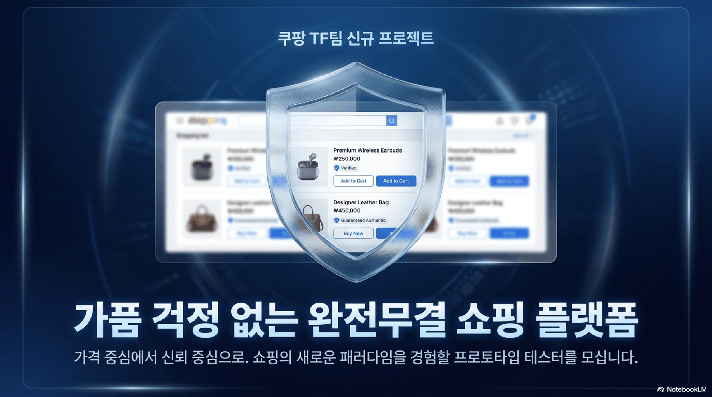
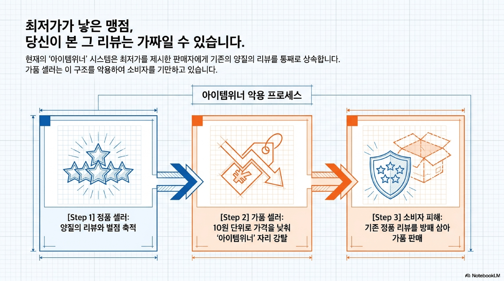
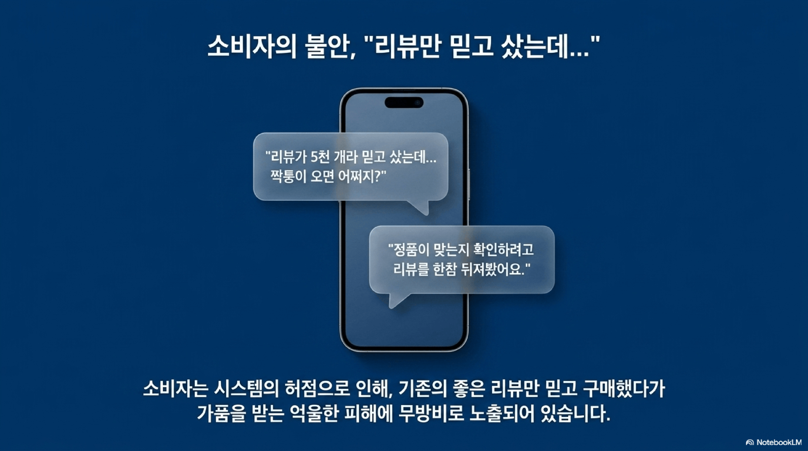
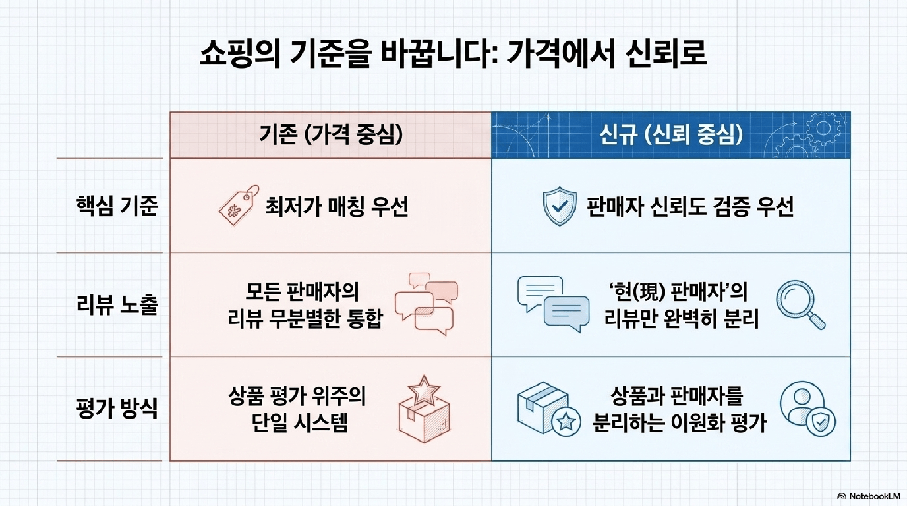
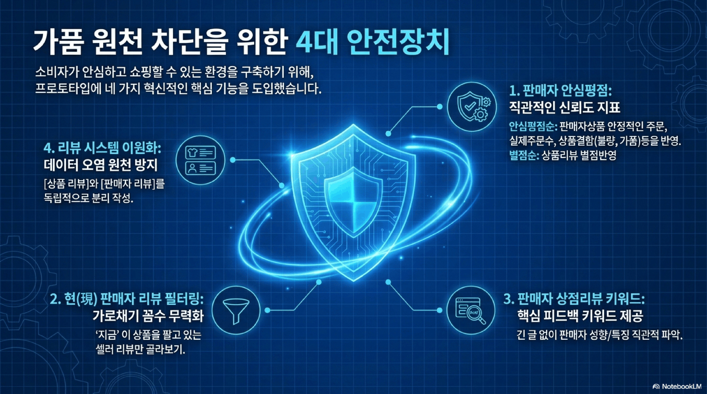
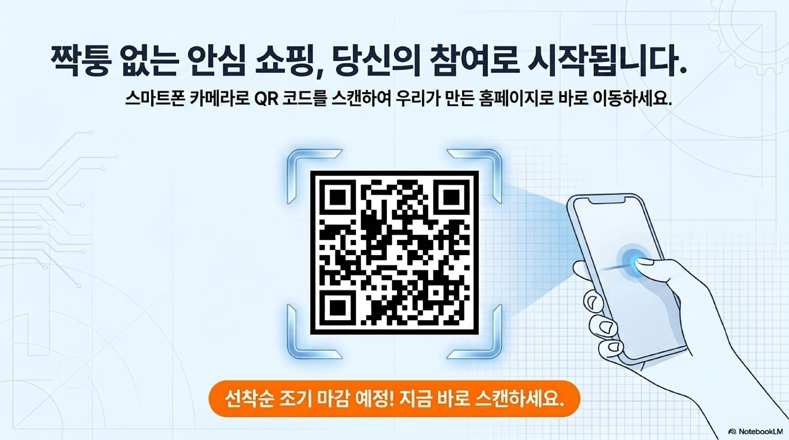

[강동7기 전Z전능 AI PM] 코멘토 청년취업사관학교 DAY 06

---

## DAY 06 | 디자인 스프린트 Day 5 — 고객 인터뷰와 피드백 분석

오늘은 스프린트의 마지막 날. 실제 사용자를 만나 프로토타입을 테스트하고, 그 반응을 분석해 개선 방향을 도출하는 날이었다.

---

### 고객 인터뷰 진행 방식

인터뷰는 1인당 총 20분(인터뷰 15분 + 정리 5분), 1:1 대면 방식으로 진행했다.

| 역할        | 내용                                     |
| ----------- | ---------------------------------------- |
| 인터뷰 담당 | 고객과 1:1로 직접 인터뷰 진행            |
| 기록 담당 1 | 답변 내용 실시간 정리 및 녹화            |
| 기록 담당 2 | 고객 반응과 인상 깊은 답변 포스트잇 메모 |
| 기술 보조   | 고객 안내, 기기 세팅, 추가 질문 전달     |

인터뷰는 5단계로 구성했다: 아이스브레이킹 → 고객 파악 → 프로토타입 시연 → 질문하기 → 마무리. 사용자가 스스로 탐색하도록 유도하고, 막힐 때만 최소한으로 개입하는 게 핵심이었다. "정답 없이 느끼신 그대로 솔직하게 말씀해 달라"는 안내로 부담을 덜어드렸다.

선아님이 작성해준 인터뷰 초안을 팀이 함께 검토하며 질문 내용을 다듬었고, 리뷰이에게 프로토타입을 직관적으로 설명하기 위한 PDF 자료도 만들었다.

    

---

### 프로토타입 준비 과정

유저 테스트를 위해 인터랙션이 동작하는 프로토타입이 필요했는데, Figma 무료 버전으로는 우리가 원하는 수준의 인터랙션 구현에 한계가 있었다. 그래서 Figma MCP와 Claude Code를 연동해 빠르게 개발하는 방식으로 방향을 틀었다.

프론트엔드 개발 경험이 있어서 코드 기반으로 전환하는 게 오히려 빠르겠다 판단했고, Claude Code로 컴포넌트를 잡고 디테일을 다듬어가며 완성했다. 완성된 프로토타입은 GitHub Pages로 배포하고 QR코드로 만들어서 테스터가 별도 설치 없이 핸드폰으로 바로 접근할 수 있게 했다.

---

### 유저 테스트 진행

3명 테스트 후 중복으로 나오는 개선안 중 빠르게 반영 가능한 것들을 즉시 수정하고, 총 5명의 유저 테스트를 완료했다.

**A 유저**

- 쿠팡 주간 이용자. 로켓배송 상품 위주로 탐색하며, 상품에 따라 가격과 리뷰를 선택적으로 참고
- 아이템 위너 시스템 몰랐음
- 판매자 정보 확인하는 진입점을 찾지 못함 → UX 개선 필요
- 안심 평점 뱃지가 너무 작아 눈에 안 띔. 어떤 기준의 지표인지(쿠팡 기준인지, 유저 데이터 기반인지) 불명확
- 현재 판매자 리뷰 필터가 강조되면 좋겠다는 의견
- "기존보다 20~30% 정도 신뢰도가 생길 것 같다"
- 리뷰 키워드에 정품 인증 관련 키워드가 있으면 좋겠다는 제안

**B 유저**

- 쿠팡에서 가품 수령 경험 있음 (금액이 크지 않아 환불 처리)
- 아이템 위너 시스템 몰랐음
- 배경 지식 없이 보면 리뷰가 여러 판매자 것이 혼재되어 있다는 걸 인지하기 어려움
- 안심 평점이 눈에 잘 안 들어옴. 어떤 기준인지 알아야 신뢰 가능
- 판매자 리뷰와 상품 리뷰가 분리되어야 가품 여부 파악에 실질적 도움이 됨
- "배경 지식을 알면 유용하다"

**C 유저**

- 가격 60~70%, 리뷰가 뒷받침돼야 구매하는 스타일
- 아이템 위너 시스템 어느 정도 알고 있었음
- 안심 평점보다 가격에 먼저 끌렸으나, 안심 평점이 낮으면 망설여짐
- "현재 판매자 리뷰만 보기" 기능 긍정적. 네이버 리뷰 같다는 반응
- 키워드 여러 개 선택 가능하면 좋겠다는 제안
- 긍정 지표들이 하단에 배치되어 있어 낮은 점수처럼 느껴진다는 피드백

**D 유저**

- 리뷰를 더 중요하게 보는 편. 불량품 수령 경험 있음
- 아이템 위너 시스템 몰랐음
- "현재 판매자 리뷰만 보기" 기능이 제일 좋았다는 반응
- 안심 평점이 상품 기준인지 판매자 기준인지 모호함. "슈퍼 판매자" 같은 직관적인 문구 제안
- '자세히 보기' 버튼이 약관 버튼처럼 보여 클릭하지 않게 됨 → 워딩과 디자인 개선 필요
- 리뷰 키워드에서 부정 키워드를 통해 판매자 파악이 잘 됐다는 긍정 반응

**E 유저**

- 가격과 리뷰 둘 다 봄. 가품 경험 있음 (나이키 신발)
- 아이템 위너 시스템 몰랐음
- 판매자 상점 링크가 눈에 잘 안 띄었음
- 현재 판매자 리뷰 시스템을 보고 "쿠팡에 반감을 느낄 것 같다. 이걸 지금까지 안 알려줬다고?"
- 리뷰 키워드에서 부정 키워드를 통해 가품 여부 판단 가능하다고 느낌
- "기존 쿠팡 신뢰도가 낮았는데도 75% 정도 신뢰도가 올라간 것 같다"

---

### 피드백 분류 및 우선순위 설정

인터뷰 피드백은 긍정 / 중립 / 부정 / 인사이트 4가지로 분류했다. 이후 아이젠하워 매트릭스를 기준으로 우선순위를 나눴다.

| 우선순위         | 기준                             |
| ---------------- | -------------------------------- |
| Mandatory        | 즉시 해결 필요 (긴급 + 중요)     |
| Very Important   | 핵심 기능과 직결 (중요 + 비긴급) |
| Rather Important | 만족도 향상 (비중요 + 긴급)      |
| Optional         | 여유 있을 때 고려                |
| Does not matter  | 영향력 낮아 보류                 |

5명의 테스트에서 중복으로 나온 피드백은 다음과 같다.

- 판매자 정보 진입점이 눈에 안 띔 → 여러 유저가 찾지 못함
- 안심 평점의 기준과 대상(상품인지 판매자인지)이 불명확
- 안심 평점 뱃지 크기가 작아 시인성 낮음
- 현재 판매자 리뷰 필터 강조 필요
- 리뷰 키워드 복수 선택 기능 요청

이 내용을 바탕으로 우선순위를 정리해 프로토타입에 반영할 예정이다.

---

### 오늘의 한 줄

기획할 때 당연하다고 생각했던 것들이 실제 사용자 앞에서는 전혀 보이지 않았다. 설명 없이 혼자 서야 하는 게 제품이라는 걸 다시 한번 실감했다.

---

#취업 #부트캠프 #청년취업사관학교 #새싹 #AIPM #DX교육 #AI교육 #실무프로젝트 #실무경험 #취업포트폴리오 #포트폴리오 #전Z전능 #코멘토 #모비니티
