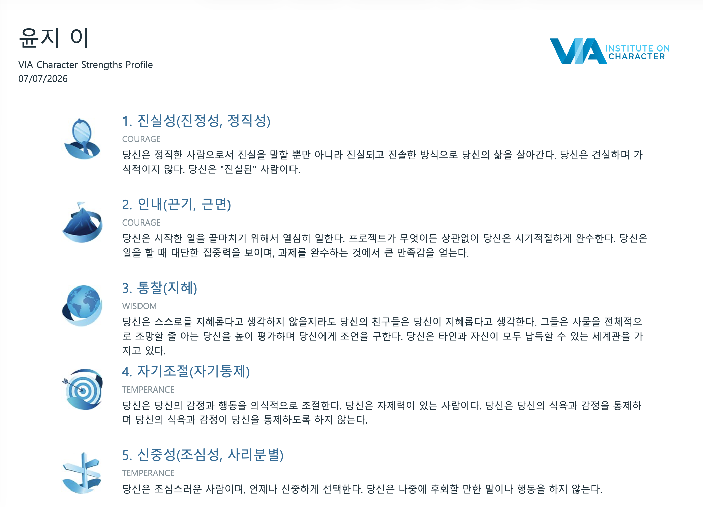

[강동7기 전Z전능 AI PM] 코멘토 청년취업사관학교 DAY 08

---

## DAY 07 | 프로젝트 관리와 팀 커뮤니케이션 — 일이 되게 하는 PM의 역량

지난 한 주 동안 치열하게 달렸던 디자인 스프린트가 끝나고, 오늘은 정찬송 멘토님과 함께 지난 과정을 '프로젝트' 관점에서 되돌아보며 체계적으로 관리하고 소통하는 방법을 배우는 시간을 가졌다.

---

### 나만의 길을 찾는 여정과 VIA 강점검사

- **새싹선배 특강**: 선배 PM이 들려주는 커리어 방향성에 대한 특강. 나만의 길을 찾는 여정에 대해 깊이 고민해볼 수 있었다.
- **VIA 강점검사**: 성격 강점을 진단해 나를 이해하고 팀원 간 시너지를 찾기 위한 도구. 지혜, 용기, 인애, 정의, 절제, 초월 6개 덕목 아래 24개 성격 강점으로 구성된다. 팀원들의 성향과 강점을 파악하고 협업 시너지를 내는 원리를 학습했다.



---

### 프로젝트 킥오프 문서 작성 실습

지난주 디자인 스프린트도 목표, 범위, 일정, 역할이 존재했던 하나의 프로젝트였다. 시작 단계에 합의된 문서가 있고 없고는 진행 과정에 엄청난 차이를 만든다.

**프로젝트 킥오프 문서(프로젝트 헌장)**란 프로젝트 시작 시점에 목표, 범위, 주요 일정, 역할(R&R), 용어 정의 등을 모든 이해관계자가 합의하여 작성하는 한 장의 문서다. 전 세계 프로젝트 관리 표준 가이드인 **PMBOK**에서도 중요하게 다뤄지는 필수 문서로, 구두 합의는 휘발되지만 문서는 남아서 언제든 기준점으로 돌아갈 수 있다.

**킥오프 문서의 5대 구성 요소**

1. **프로젝트명 및 목표(Goal)**: 무엇을 왜 하는지, 성공 기준 명시
2. **업무 범위(Scope)**: 할 것과 하지 않을 것 선언
3. **주요 일정(Timeline)**: 마일스톤과 데드라인, 필요 시 WBS 활용
4. **역할(R&R)**: 누가 어떤 책임을 지는지, 최종 승인권자 정의
5. **용어 정의(Definitions)**: 애매한 용어를 사전에 정의해 소통 비용 절감

실습은 기존 스프린트 조를 벗어나 5인의 새로운 조를 구성한 뒤, 지난주 디자인 스프린트 경험을 5가지 요소로 압축해 정리하고 발표하는 방식으로 진행했다.

---

### 이슈 트래킹 & 트러블슈팅

PM에게 이슈는 예외적인 사고가 아니라 **프로젝트의 기본값**이다. 언제든 일어날 수 있음을 인지하고 대비하는 자세가 필요하다.

**자주 나타나는 7대 이슈 카테고리**
범위 변경 / 일정 지연 / 인력 공백 / 커뮤니케이션 지연 / 기술·품질 결함 / 이해관계자 우선순위 충돌 / 예산·자원 부족

**이슈 대응 프로세스 5단계**
발견 → 기록 → 우선순위 설정 → 해결 → 회고

**사례 분석 실습**

각자 IT 프로젝트 이슈 사례를 조사해 대비책과 대응 방안을 1장의 슬라이드로 정리하고 투표로 공유했다.

나는 **카카오 데이터센터 화재 사고**를 조사했다. 단일 데이터센터 의존 구조가 전면 서비스 장애로 이어진 사례로, 이중화 구조와 재해복구(DR) 계획의 중요성을 다시 한번 확인할 수 있었다.

팀 내 최종 채택된 사례는 **카카오톡 친구탭 UI 개편 이슈**였다. 카카오는 2025년 9월 친구탭을 격자형 피드 중심으로 전면 개편했는데, 개편 직후부터 "친구를 찾기 어렵다", "메신저가 아니라 SNS 같다"는 사용자 반발이 거세게 이어졌다. 결국 약 3개월 만에 친구목록 기본 화면을 복원하고, 피드형 UI는 '소식' 탭으로 분리해 선택 기능으로 남기는 방식으로 수습했다. 사용자 검증 없이 핵심 UX를 바꿨을 때 생기는 리스크, 그리고 빠른 의사결정과 대응이 얼마나 중요한지를 잘 보여주는 사례였다.

---

### 일이 되게 하는 PM의 문서화

아무리 훌륭한 시스템이 있어도 정보가 의사결정권자에게 빠르게 전달되지 못하면 치명적인 실패로 이어진다.

- **보잉 737 MAX 사고(2018~2019)**: MCAS 소프트웨어 오작동 우려가 조직 위로 신속히 전달되지 못해 5개월 사이에 동일 기종 참사가 두 번 반복됐다
- **삼성 갤럭시 노트7 발화 사고(2016~2017)**: 엔지니어 700명이 참여한 20만 대 규모 재현 실험 결과를 전 세계 생중계로 공개했다. 사고 자체보다 **그 이후 무엇을 어떻게 공개했는지가 신뢰 회복의 핵심**이었다

**PM이 항상 관리해야 할 3대 문서**

1. **회의록 및 의사결정 히스토리**: 의사결정 맥락과 판단의 근거
2. **프로젝트 헌장**: 시작 단계에 합의된 방향성
3. **WBS**: 주요 일정별 과업, 진척도, 담당자를 한눈에

**에스컬레이션(Escalation)**

감당 가능한 수준을 넘어서는 문제가 생겼을 때, 정해진 프로세스를 따라 의사결정권자에게 신속히 알리고 해결을 구하는 구조적 소통이다. 도요타의 '안돈 코드'처럼 보고의 기준(threshold), 대상(라인), 형식이 명확히 수립되어야 한다.

---

### 오늘의 한 줄

킥오프 문서로 합의를 명문화하고, 이슈 트래킹으로 문제를 포착하는 것. 결국 일이 되게 만드는 PM은 열심히 일하는 사람이 아니라 문서를 관리하고 소통의 끈을 놓지 않는 사람이었다.

---

#취업 #부트캠프 #청년취업사관학교 #새싹 #AIPM #DX교육 #AI교육 #실무프로젝트 #실무경험 #취업포트폴리오 #포트폴리오 #전Z전능 #코멘토 #모비니티

```

```
