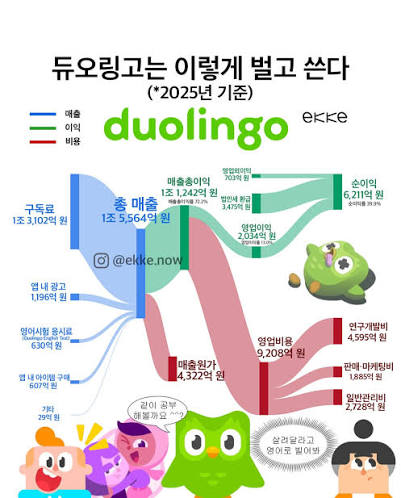

[강동7기 전Z전능 AI PM] 코멘토 청년취업사관학교 DAY 15

## DAY 15 | 듀오링고 에너지 시스템 역기획하기

_출처: [ekke.now 인스타그램](https://www.instagram.com/p/DZmqPy4SwbP/)_

오늘은 AI 서비스 역기획 6-Step 포뮬러를 실습했다. 대상은 듀오링고. 정확히는 듀오링고가 2026년 초부터 바꾼 에너지(Energy) 시스템이다.

### 왜 듀오링고였나

요즘 듀오링고로 일본어 공부를 하는 중인데, 문제를 열심히 풀다가 갑자기 에너지가 바닥나서 레슨이 끊기는 경험이 몇 번 있었다.
3번째 레슨쯤 되면 에너지가 없다.

이전에는, 하트 시스템이였어서 문제를 틀리지않으면 거의 무한으로 진행이 가능했다고 알고 있는데 왜 바뀌었는지, 수익구조 때문이라면 불편함을 개선할 방법이 있을지 궁금하여 선정했다.

### Step 1. 서비스 및 타겟 기능 선정

타겟 기능은 듀오링고의 에너지 시스템으로 잡았다. 2025년 4월 일부 유저 대상 테스트를 거쳐 2026년 초부터 전체로 확대됐다.
무료 유저는 하루 25 에너지로 시작하고, 에너지가 바닥나면 그 자리에서 레슨이 막힌다.

### Step 2. 창업자 스토리 & 궁극적 목표 찾기 (Why)

창업자는 폰 안(Luis von Ahn)과 세베린 하커(Severin Hacker). 폰 안은 과테말라 출신으로, 교육이 부유층에게만 제대로 주어지는 현실을 보고 자란 게 창업 배경이라고 한다.
CAPTCHA, 이어서 reCAPTCHA를 만들어 구글에 매각한 이력이 있고, 그 연장선에서 "누구나 무료로 언어를 배울 수 있어야 한다"는 미션으로 듀오링고를 세웠다.

지금 회사가 밀고 있는 로드맵도 확인했다. DAU 5천만에서 3년 내 1억을 목표로 마찰 요소를 줄이는 데 집중하고 있고, Speaking Adventures와 Focus Mode 같은 신규 기능을 준비 중이다. 코스 유닛 발행량도 분기당 7,100개에서 20,500개로 늘렸다.

### Step 3. 비즈니스 모델(BM) 파악

FY2025 10-K를 찾아봤다. 총매출 10억 3,760만 달러 중 구독료가 8억 7,340만 달러, 비중으로는 84.2%다. 광고, 응시료, 인앱구매를 다 합쳐도 15.8%밖에 안 된다. 순이익률은 39.9%로 찍혀 있지만 이 중 상당 부분이 일회성 세금 혜택이라 실질 순이익률은 15% 정도로 봐야 한다.

이 구조를 보고 나니 스트릭이나 에너지 시스템 같은 리텐션 장치들이 결국 구독 매출을 극대화하기 위한 깔때기라는 게 납득이 됐다.

### Step 4. 고객 문제 정의 및 서비스 차별점 파악

문제를 두 가지로 나눠봤다. 하나는 에너지 시스템의 강제 중단이고, 다른 하나는 영상 통화 같은 프리미엄 기능이 무료 유저의 학습 경로에 아이콘만 노출되고 탭하면 페이월로 막히는 노출형 페이월이다.

두 문제를 관통하는 진짜 문제는 이렇게 정리했다. 무료 유저가 학습에 몰입한 바로 그 순간, 구독 전환을 유도하는 방식이다. 아이러니한 건 열심히 하는 유저일수록, 즉 충성 유저 후보군일수록 이 마찰을 더 자주 겪는다는 점이다.

### Step 5. FGI 시뮬레이션으로 아이디어 검증

까칠한 유저 페르소나를 세우고 인터뷰 형식으로 아이디어를 검증했다. 처음 낸 아이디어는 "보상 상자를 이용한, 충성 유저 대상 월간 랜덤 체험권"이었는데 바로 반박당했다. 보상이 랜덤이면 노력과 결과가 연결되지 않아 신뢰를 오히려 깎고, 무엇보다 핵심 문제인 "레슨 도중 순간적 차단"을 직접 해결하지 못한다는 지적이었다. 결국 이 아이디어는 Out-of-Scope로 접었다.

_클로드야 무섭다 너.._

### Step 6. PRD 작성

최종적으로 수렴한 건 소프트 랜딩(Soft Landing)이다. 레슨 도중 에너지가 0이 되어도 그 레슨만은 끝까지 완료할 수 있게 두고(1일 1회 한정), 완료 화면에서 배려 메시지와 함께 구독 유도 CTA를 노출한다. 에너지 시스템 자체를 없애는 건 매출 구조상 채택 불가로 처음부터 제외했고, 대신 마찰의 방식과 타이밍만 조정하는 쪽으로 방향을 잡았다.

정책을 다듬으면서 걸린 부분이 하나 있었다. 기존에는 레슨 시작 전 "에너지가 부족해요" 경고가 항상 떴는데, 소프트 랜딩이 생기면 이 경고의 의미가 그날 소프트 랜딩을 이미 썼는지에 따라 달라진다.
그래서 이렇게 분기했다. 오늘 소프트 랜딩을 아직 안 썼다면 사전 경고는 아예 띄우지 않고, 대신 레슨 도중 실제로 에너지가 0이 되는 순간 충전 모션과 함께 "이번 레슨까지는 끝까지 이용하실 수 있게 해드릴게요!" 메시지를 보여주며 끊김 없이 이어간다. 반대로 오늘 소프트 랜딩을 이미 썼다면 예전처럼 레슨 시작 전에 "완료하지 못할 수 있어요" 경고를 그대로 띄워서 실제 차단 가능성을 미리 알린다.
하나의 배려 장치를 추가했을 뿐인데 기존 경고 로직 하나를 통째로 다시 설계해야 했다. 기능은 단독으로 존재하지 않고 기존 로직과 항상 얽혀 있다는 걸 새삼 느꼈다.

> [!note]- PRD 전문 보기: 에너지 시스템 몰입 차단 완화 — "소프트 랜딩" 기능
> **대상 서비스**: Duolingo (모바일 앱) · **작성 배경**: AI 서비스 역기획 6-Step 포뮬러 실습 · **작성일**: 2026-07-16
>
> #### 1. 배경 / 문제 (Why)
>
> **왜 지금인가**
> Duolingo는 2026년 초부터 기존 하트(Hearts) 시스템을 에너지(Energy) 시스템으로 전면 전환했다. 무료 유저는 하루 25 에너지로 시작하며, 정답 시 1, 오답 시 1~2가 소모된다.
>
> 리서치 결과 실사용자들이 실수 없이도 3번째 레슨쯤에서 에너지가 소진되는 경험을 다수 보고했으며, 이 때문에 "그만두겠다"는 이탈 반응까지 관찰된다.
>
> **진짜 문제 정의**
>
> > 듀오링고는 무료 유저의 학습 몰입도가 높아진 순간(레슨 진행 도중) 예고 없이 에너지가 소진되어 레슨이 강제 중단되는 구조이며, 이는 학습 효과와 만족도를 떨어뜨리고 특히 열심히 학습하는 헤비 유저(=충성 유저 후보군)일수록 더 자주, 더 크게 겪는 역설적인 문제다.
>
> 레슨 시작 전 에너지 부족 경고는 이미 존재하지만, 경고를 인지하고도 시작한 유저 혹은 시작 시점엔 충분했으나 도중 소진된 유저는 이 경고로 보호받지 못한다.
>
> **비즈니스 맥락 (BM 정합성)**
>
> - 2025 회계연도 기준 구독료가 전체 매출의 84.2%를 차지하는 압도적 핵심 수익원이다. (Source: Duolingo 10-K FY2025)
> - 따라서 "에너지 시스템 전면 폐지"는 채택 불가. 무료 이용 접근성(미션)은 지키되, 무제한 이용까지 무료로 보장하지 않는다는 현재의 경계선은 유지한 채 마찰의 '방식'과 '타이밍'만 조정하는 방향으로 문제를 해결한다.
>
> #### 2. 목표 및 성공 지표 (KPI)
>
> **목표**: 레슨 도중 강제 차단으로 인한 부정적 경험을 줄이고, 그 배려의 순간을 구독 전환의 긍정적 접점으로 전환한다.
>
> | 지표                       | 정의                                                            | 목표                                                    |
> | -------------------------- | --------------------------------------------------------------- | ------------------------------------------------------- |
> | 레슨 중도 이탈률           | 에너지 소진으로 레슨을 완료하지 못하고 이탈한 세션 비율         | 기존 대비 감소                                          |
> | 소프트 랜딩 후 구독 전환율 | 소프트 랜딩 배려 메시지 노출 후 7일 내 Super/Max 구독 전환 비율 | 신규 트래킹 지표로 도입, 베이스라인 확보 후 목표치 설정 |
> | D1/D7 리텐션               | 에너지 소진 경험 유저 vs 비경험 유저의 익일/7일 재방문율 격차   | 격차 축소                                               |
> | NPS/앱스토어 리뷰 감성     | "에너지", "energy" 키워드 포함 부정 리뷰 비율                   | 감소                                                    |
>
> #### 3. 범위 및 Out-of-Scope
>
> **In-Scope**
>
> - 에너지 소진 시점에 진행 중이던 레슨 1개를 끝까지 완료할 수 있도록 허용 (소프트 랜딩)
> - 소프트 랜딩 완료 직후, 배려 메시지 및 구독 유도 CTA 노출
> - 소프트 랜딩 사용 빈도 제한 정책 수립 (형평성 방어)
>
> **Out-of-Scope (이번 PRD에서 다루지 않음)**
>
> - 에너지 시스템 자체의 폐지 또는 하트 시스템으로의 회귀
> - 충성 유저(n일 연속 스트릭) 대상 월간 퀘스트 랜덤 체험권: 초기 아이디어로 검토했으나, (1) 보상이 랜덤이라 노력과 결과가 연결되지 않아 신뢰도를 오히려 낮출 수 있고, (2) 정의된 핵심 문제(레슨 도중 순간적 차단)를 직접 해결하지 못해 채택하지 않음
> - 신규 유저 7일 무료 체험 정책 자체의 변경 (기존 정책 유지, 본 PRD 범위 아님)
> - 영상 통화(Video Call) 등 Max/Super 전용 기능의 무료 개방 여부
>
> #### 4. 기능, 정책 및 예외 케이스
>
> **4.1 소프트 랜딩 (Soft Landing)**
>
> - 트리거 조건: 유저가 레슨을 진행하는 도중 에너지가 0이 되는 경우
> - 동작: 에너지가 0이 되는 즉시 레슨을 끊지 않고, 에너지가 차오르는 연출 모션과 함께 "이번 레슨까지는 끝까지 이용하실 수 있게 해드릴게요!" 메시지를 보여준 뒤, 해당 레슨은 에너지 차감 없이 끝까지 진행 가능. 레슨 완료 전까지는 추가 문제에서도 에너지가 소모되지 않음
> - 제한: 1일 1회 한정 (자정 기준 리셋). 레슨 시작 전부터 에너지가 0인 경우는 대상 아님 (기존 사전 경고 로직 적용 유지)
>
> **4.2 배려 메시지 + 전환 CTA**
>
> - 노출 시점: 소프트 랜딩으로 완료된 레슨의 결과 화면
> - 메시지 예시(안): "에너지가 부족했지만, 이번 레슨은 끝까지 이용하실 수 있도록 도와드렸어요."
> - CTA: "Super로 업그레이드하면 에너지 걱정 없이 학습할 수 있어요" 버튼 노출 (닫기 가능, 강제 아님)
>
> **4.3 예외 케이스**
>
> - 하루 2번째 이상 에너지 소진: 기존과 동일하게 레슨 중단, 광고 시청/젬 사용/구독 유도 노출
> - 이미 구독 중인 Super/Max 유저: 본 기능 노출 대상 아님 (에너지 무제한이므로 해당 없음)
> - 기존 "레슨 시작 전 에너지 낮음" 경고와의 연동: 소프트 랜딩 도입으로 이 경고의 의미가 그날 소프트 랜딩 사용 여부에 따라 달라지므로, 다음과 같이 분기한다.
>   - 오늘 소프트 랜딩 미사용 시: 레슨 시작 전 사전 경고는 노출하지 않는다. 대신 레슨 진행 중 실제로 에너지가 0이 되는 시점에, 에너지가 차오르는 연출 모션과 함께 안내 메시지를 보여주고 끊김 없이 이어서 진행되도록 한다.
>   - 오늘 소프트 랜딩 기사용 시: 기존과 동일하게 레슨 시작 전 "에너지가 부족해 레슨을 완료하지 못할 수 있어요" 경고를 노출해 실제 차단 가능성을 명확히 전달한다.
>
> #### 5. Acceptance Criteria (인수 조건)
>
> - [ ] 무료 유저가 레슨 진행 중 에너지가 0이 되어도, 해당 레슨은 추가 에너지 차감 없이 끝까지 완료할 수 있다
> - [ ] 소프트 랜딩은 유저당 1일 1회로 제한되며, 2회차부터는 기존 차단 로직이 그대로 적용된다
> - [ ] 소프트 랜딩으로 완료된 레슨의 결과 화면에는 배려 메시지와 구독 유도 CTA가 노출된다
> - [ ] CTA는 닫기(무시) 가능하며, 무시해도 레슨 완료 기록/XP/스트릭은 정상 반영된다
> - [ ] 이미 유료 구독 중인 유저에게는 본 기능 및 메시지가 노출되지 않는다
> - [ ] 소프트 랜딩 발생 여부, CTA 클릭 여부, 이후 7일 내 구독 전환 여부가 각각 로깅되어 KPI 대시보드에서 추적 가능하다
> - [ ] 오늘 소프트 랜딩을 사용하지 않은 유저는 레슨 시작 전 에너지 낮음 경고 없이 진행하며, 실제 에너지가 0이 되는 시점에 충전 모션과 안내 메시지가 노출된다
> - [ ] 오늘 소프트 랜딩을 이미 사용한 유저는 기존과 동일하게 레슨 시작 전 에너지 부족 경고가 노출된다
>
> #### 6. NFR / 오픈 이슈 및 결정 로그
>
> **NFR (비기능 요구사항)**
>
> - 소프트 랜딩 판정은 클라이언트-서버 간 실시간 동기화가 필요하며, 오프라인 상태에서의 어뷰징(에너지 우회) 방지 로직 필요
> - 1일 1회 제한 카운트는 서버 기준 타임존으로 관리 (유저 디바이스 시간 조작 방지)
>
> **오픈 이슈**
>
> - 소프트 랜딩을 의도적으로 유발하기 위해 유저가 고의로 오답을 반복해 에너지를 빠르게 소진시키는 어뷰징 가능성 → 추가 방어 로직(예: 짧은 시간 내 반복 오답 패턴 감지) 필요 여부는 별도 검토 필요
> - 배려 메시지의 정확한 카피 및 CTA 디자인은 A/B 테스트를 통해 최종 확정
> - "1일 1회"라는 빈도가 적절한지는 출시 후 데이터 기반으로 재조정 가능성 있음
>
> **결정 로그**
>
> | 날짜       | 결정 사항                                                      | 근거                                                                                               |
> | ---------- | -------------------------------------------------------------- | -------------------------------------------------------------------------------------------------- |
> | 2026-07-16 | 에너지 시스템 전면 폐지는 채택하지 않음                        | 구독료가 전체 매출의 84.2%를 차지 (Duolingo 10-K FY2025), 비즈니스 지속가능성 훼손 우려            |
> | 2026-07-16 | 충성 유저 대상 월간 랜덤 체험권 아이디어는 Out-of-Scope로 제외 | 보상의 랜덤성이 노력-보상 연결을 약화시키고, 핵심 문제(레슨 도중 순간적 차단)를 직접 해결하지 못함 |
> | 2026-07-16 | 소프트 랜딩 + 배려 메시지 조합을 최종 솔루션으로 채택          | 몰입 차단이라는 즉각적 불만을 직접 해소하면서, 동시에 구독 전환 유도 접점으로 활용 가능            |

받은 피드백: 구독제 외 횟수권 도입 제안
역기획 결과를 서로 공유하는 자리에서 이런 의견을 받았다.

구독제 외에도 횟수권(예: 10회 충전권)을 추가해서 유저에게 선택지를 넓혀주자
횟수권보다 구독권이 더 저렴하게 느껴지도록 가격을 설계하면, 오히려 구독 전환을 유도할 수 있다

특히 2번은 앵커링/디코이 프라이싱(decoy pricing)이라는 실제 가격 전략 기법과 맞닿아 있는 제안이다. 두 옵션을 나란히 보여주고 구독이 상대적으로 더 이득처럼 보이게 설계하면, 유저가 자연스럽게 구독 쪽으로 기울게 만들 수 있다는 논리다. 근거가 탄탄한 아이디어라 다음에 기회가 되면 별도로 깊게 다뤄보고 싶다.

### 역기획하면서 느낀 것

배경, 구조, 유저 반응을 순서대로 짚어보니 기업과 유저의 니즈를 동시에 만족시키는 건 쉽지 않다는 걸 느꼈다. 회사 입장에서는 구독료가 매출의 84%인 이상 에너지 시스템을 없애자는 결론을 낼 수가 없다. 유저 입장에서는 몰입하던 순간 끊기는 경험 자체가 불쾌하다. 둘 다 각자 자리에서는 맞는 말이라, 어느 한쪽 손을 들어주는 방식으로는 문제가 안 풀렸다.
그래서 결국 남는 선택지는 "누가 옳은가"가 아니라 "마찰이 발생하는 지점과 방식을 어떻게 조정할까"였다. 소프트 랜딩도 유저의 불만을 없애는 동시에 회사의 구독 전환 니즈까지 챙기는, 양쪽 다 완전히 이기지는 못해도 접점을 찾는 결과물이었다.

> [!note]- 참고 자료 (리서치 출처)
>
> - [Duolingo, Inc. Form 10-K, FY2025 (SEC EDGAR)](https://www.sec.gov/Archives/edgar/data/1562088/000162828026012494/duol-20251231.htm)
> - [Why Duolingo switched to Energy and how it helps you learn — blog.duolingo.com](https://blog.duolingo.com/duolingo-energy/)
> - [I'm finally quitting Duolingo after this change — Android Authority](https://www.androidauthority.com/quitting-duolingo-energy-system-3599842/)
> - [Duolingo Breaks Hearts for Energy, Drains Free Learning — Class Central](https://www.classcentral.com/report/duolingo-breaks-hearts-for-energy/)
> - [Duolingo's 2026 Strategy: The Road to 100 Million DAUs — Class Central](https://www.classcentral.com/report/duolingo-2026-strategy/)
> - [Duolingo Reports First Quarter 2026 Results — investors.duolingo.com](https://investors.duolingo.com/news-releases/news-release-details/duolingo-reports-first-quarter-2026-results)
> - [Duolingo Users Revolt Over "Energy" Update — toptechguides.com](https://toptechguides.com/duolingo-energy-update-backlash/)
> - [Duolingo's Energy system leaves longtime users feeling punished — techissuestoday.com](https://techissuestoday.com/duolingo-energy-system-user-backlash/)
> - [The Visionary Behind Duolingo: How Luis von Ahn Revolutionized Learning — earlystartupdays.com](https://www.earlystartupdays.com/p/duolingo)
> - [Duolingo's Habit-Forming Reminders: A UX Breakdown — digia.tech](https://www.digia.tech/post/duolingo-habit-forming-reminders-retention-architecture/)
> - [Duolingo Streaks: How the Mechanic Drives 2x Daily Retention — deconstructoroffun.com](https://duolingo.deconstructoroffun.com/mechanics/streaks)

#취업 #부트캠프 #청년취업사관학교 #새싹 #AIPM #DX교육 #AI교육 #실무프로젝트 #실무경험 #취업포트폴리오 #포트폴리오 #전Z전능 #코멘토 #모비니티
