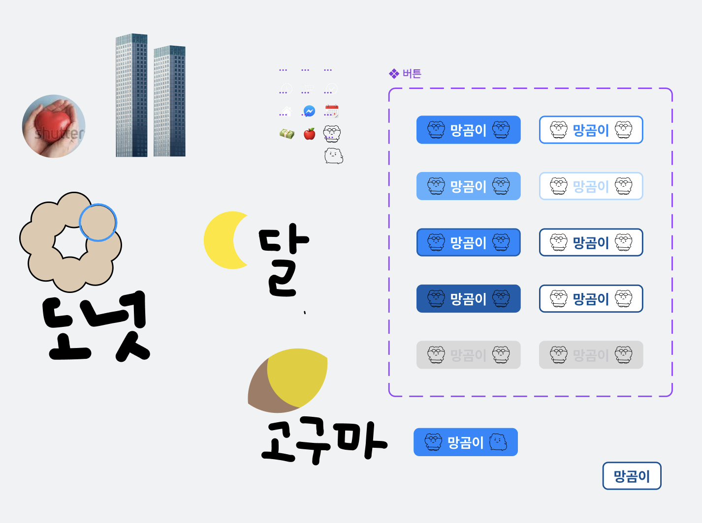
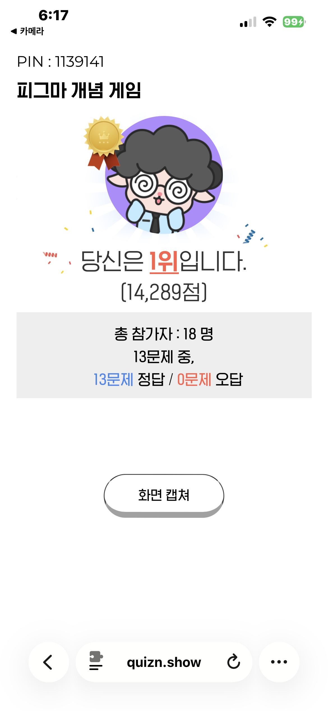

[강동7기 전Z전능 AI PM] 코멘토 청년취업사관학교 DAY 19

## DAY 19 | 피그마 컴포넌트 심화 - 베리언트와 속성(Property) 정복하기

오늘도 피그마 수업을 이어갔다. 이번엔 컴포넌트와 인스턴스를 복습하는 걸 넘어서, 그 위에 변수와 속성(Property)을 얹어 버튼 하나를 "컴포넌트"로 만드는 법을 배웠다.

### 오토레이아웃으로 버튼 만들고 컴포넌트화하기

시작은 기본 버튼 제작 흐름이었다. 텍스트를 만들고 `Shift + A`로 오토레이아웃을 씌운 뒤, 상하좌우 패딩을 잡고 색상과 모서리 반경(Corner Radius)까지 정리하면 기본 버튼이 완성된다. 이렇게 만든 프레임을 `Opt + Cmd + K`(윈도우는 `Ctrl + Alt + K`)로 컴포넌트화하면 에셋 패널에 등록되고, 이후로는 드래그만으로 화면 어디든 배치할 수 있다.

버튼을 컴포넌트로 만드는 과정을 보면서, 예전에 디자인 시스템을 구축하느라 이것저것 찾아보던 때가 문득 떠올랐다. 그때는 버튼 하나에 상태값이 몇 개나 필요한지, 이름은 어떻게 붙여야 나중에 헷갈리지 않는지를 감으로 정리했었는데, 개발을 하는게 아니라 피그마에서 직접 만들어보니 재밌었다.

### 컴포넌트-인스턴스 관계, 이번엔 되돌리기까지

컴포넌트(부모)를 고치면 모든 인스턴스(자식)에 실시간으로 반영되고, 인스턴스를 개별 수정해도 부모에는 영향이 없다는 기본 관계는 지난 시간과 같았다. 오늘 새로 배운 건 이 관계를 양방향으로 다루는 법이다. 인스턴스에 손댄 걸 다 지우고 부모와 동일하게 되돌리고 싶으면 우클릭 후 'Reset instance', 반대로 인스턴스에서 수정한 내용을 부모 쪽으로 역으로 반영해서 모든 인스턴스를 그 상태로 맞추고 싶으면 'Push overrides to main component'를 쓰면 된다. 되돌리는 방향과 밀어 넣는 방향을 둘 다 갖췄다는 게 실무에서 왜 필요한지 바로 이해가 됐다.

### 베리언트(Variant) - 상태를 하나의 세트로 묶기

베리언트는 하나의 컴포넌트 세트 안에 여러 상태나 디자인 변형을 묶어주는 기능이다. 원본 컴포넌트를 선택하고 속성 패널의 `+`로 베리언트를 추가하면 점선으로 된 넓은 영역이 생기고, 그 안에 상태를 계속 추가할 수 있다. 버튼 하나에 보통 이 다섯 가지 상태를 구성한다고 배웠다.

- Default (기본)
- Hover (마우스 오버)
- Focus (초점)
- Press (클릭 중)
- Disabled (비활성화)

각 베리언트를 선택해서 속성 이름도 원하는 대로 바꿀 수 있고(`Property 1` → `상태` 등), 인스턴스를 배치한 뒤엔 드롭다운으로 상태를 바로 전환할 수 있다. 여러 베리언트 안의 같은 레이어를 한꺼번에 고쳐야 할 땐 레이어를 하나 선택하고 `Opt + Cmd + A`(윈도우 `Ctrl + Alt + A`)로 '일치하는 레이어 선택'을 하면 동일 레이어가 전부 잡혀서 한 번에 편집할 수 있다.

### 텍스트/불리언/인스턴스 교체 속성

여기서부터는 인스턴스를 더블클릭하지 않고도 속성 패널에서 바로 내용을 바꿀 수 있게 만드는 작업이었다.

텍스트 속성(Text Property)은 컴포넌트 세트에 `텍스트` 같은 이름과 기본값을 가진 속성을 만들고, `Opt + Cmd + A`로 모든 베리언트의 텍스트 레이어를 다중 선택한 뒤 '변수/속성 적용' 아이콘으로 연결하면 끝이다. 이후엔 인스턴스를 클릭하고 속성 패널 입력창에 타이핑만 하면 버튼 텍스트가 바로 바뀐다.

불리언 속성(Boolean Property)은 아이콘 같은 요소를 온/오프 토글로 보이거나 숨길 때 쓴다. 기본값을 True로 잡고 아이콘 레이어에 바인딩하면 되는데, 좌측·우측 아이콘을 따로 켜고 끄고 싶으면 `좌측_아이콘`, `우측_아이콘`처럼 속성을 개별로 만들어 각각의 레이어에 연결해야 한다. 하나로 묶으면 한쪽만 끄고 싶어도 양쪽이 같이 꺼져버린다.

인스턴스 교체 속성(Instance Swap Property)은 버튼 안의 아이콘을 다른 아이콘 컴포넌트로 손쉽게 갈아 끼우는 기능이다. 이걸 쓰려면 사전 작업이 좀 필요했다. 아이콘들을 전부 개별 컴포넌트로 만들고(`Create multiple components`), `apple`, `money`, `calendar`, `chat`, `Home`, `check`처럼 이름을 영문으로 직관적으로 붙여야 나중에 헷갈리지 않는다. 특히 `icon/apple`, `icon/Home`처럼 이름에 슬래시(`/`)를 넣으면 에셋 패널에서 `icon` 폴더로 자동 그룹화된다는 게 인상 깊었다. 이후 컴포넌트에 인스턴스 교체 속성을 추가하고 기본 아이콘(예: `icon/check`)을 지정한 뒤, 기존 플레이스홀더 아이콘을 새로 만든 아이콘 컴포넌트로 바꿔 끼우고 속성끼리 연결해주면 된다.

여기서도 좌우를 하나의 속성으로 묶으면 한쪽을 바꿀 때 반대쪽도 같이 바뀌어버리는 문제가 생긴다. 그래서 `좌측_인스턴스`(기본값 apple), `우측_인스턴스`(기본값 check)처럼 독립된 속성을 따로 만들고, 이름이 겹치면 경고가 뜨니 고유한 이름으로 각 레이어에 정확히 바인딩해야 완전히 분리된 제어가 가능하다는 걸 배웠다.

### 실습: 버튼 스타일 다각화와 슬롯 개념

실습에서는 면이 채워진 Fill과 테두리만 있는 Stroke 두 스타일을 속성으로 추가하고, 이걸 앞서 만든 다섯 가지 상태와 교차시켜 총 10개짜리 베리언트 세트를 만들었다. 상태 하나 늘 때마다 경우의 수가 배로 늘어나는 걸 직접 만들어보니 왜 이름 규칙과 속성 설계를 처음부터 꼼꼼히 해야 하는지 체감이 됐다.

### 오늘의 작업물

### 피그마 개념 게임

마지막으로 오늘 배운 내용을 정리하며, 게임을 진행했는데 1등 했다 야호..

#취업 #부트캠프 #청년취업사관학교 #새싹 #AIPM #DX교육 #AI교육 #실무프로젝트 #실무경험 #취업포트폴리오 #포트폴리오 #전Z전능 #코멘토 #모비니티
