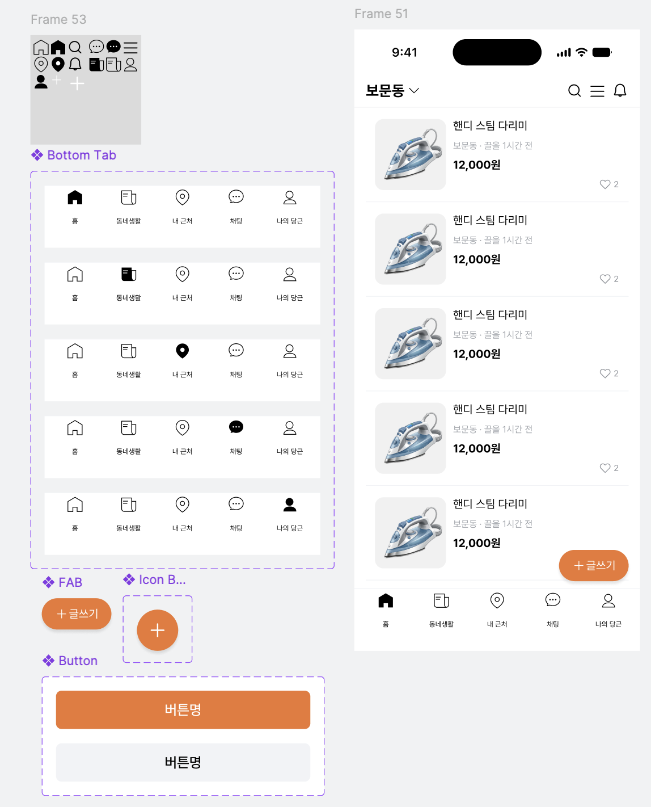

[강동7기 전Z전능 AI PM] 코멘토 청년취업사관학교 DAY 20

## DAY 20 | 피그마 프로토타입 & 인터랙션 - 당근마켓 화면 실습

컴포넌트-인스턴스 복습은 짧게 훑고 넘어가고, 오늘은 본격적으로 프로토타입 파트로 들어갔다. 정적인 화면을 넘어 실제로 눌러보고 스크롤해볼 수 있는 상태까지 만드는 게 목표였다.

### 프로토타입은 어디까지 정교해야 할까 - 골디락스 품질

가장 먼저 짚은 건 완성도 기준이었다. 너무 대충 만들면 진짜 같지 않아서 테스트하는 사람이 흐름에 몰입하지 못하고, 반대로 실제 앱 수준으로 세밀하게 만들려고 하면 검증하려던 흐름보다 프로토타입 완성 자체에 시간을 다 쓰게 된다. 그 사이 어딘가, 검증하고자 하는 흐름에 충실한 딱 적절한 수준을 찾는 게 골디락스 품질이라는 개념이었다. 프로토타입도 목적에 맞는 만큼만 만들면 된다는 말이 계속 남았다.

### 인터랙션의 3대 기둥

오늘 배운 인터랙션 기능은 세 가지로 정리됐다. 프레임을 넘는 콘텐츠의 움직임을 정하는 스크롤 동작(Scroll Behavior), 레이어명이 같을 때 크기·위치·투명도 변화를 자동으로 보간해주는 스마트 애니메이트(Smart Animate), 화면을 넘나들지 않고 컴포넌트 단위에서 상태가 알아서 전이되는 인터랙티브 컴포넌트(Interactive Component)다.

### 스크롤 동작 파고들기

스크롤은 위치(Position)와 오버플로우(Overflow) 두 축으로 제어한다. 위치는 부모와 함께 스크롤될지(Scroll with parent), 상단바처럼 항상 고정될지(Fixed), 스크롤 중 특정 지점에서 자석처럼 달라붙을지(Sticky)를 정하는 옵션이고, 오버플로우는 넘친 콘텐츠를 가로로 흘릴지, 세로로 흘릴지, 양방향으로 다 열어둘지, 아니면 그냥 고정해둘지를 정하는 옵션이다.

가로 스크롤을 구현할 때 핵심은 콘텐츠를 감싼 하위 프레임의 가로 너비를 메인 화면 프레임 폭에 딱 맞게 좁히는 것이었다. 이렇게 해야 화면 밖으로 넘어간 카드들이 잘려서 숨겨지고, 그 상태에서 오버플로우를 Horizontal로 지정해야 슬라이더처럼 동작한다. 세로 스크롤은 반대로 콘텐츠를 프레임 하단 밖으로 넘치게 배치하고 오버플로우를 세로로 지정하면 된다.

바텀시트도 다뤘다. 화면 밖에 따로 만들어둔 팝업 프레임을 트리거는 '드래그 시', 액션은 '오버레이 열기'로 연결하고, 위치는 하단 가운데, 외부 클릭 시 닫히도록 옵션을 켠 뒤, 애니메이션은 아래에서 위로(Move in, 위 방향) 300ms Ease out으로 설정하면 자연스럽게 올라오는 바텀시트가 완성됐다.

### 스마트 애니메이트와 인터랙티브 컴포넌트

스마트 애니메이트는 원리가 명확했다. 연결하는 두 프레임 안의 레이어명이 대소문자까지 완전히 같으면, 피그마가 크기·위치·회전 차이를 계산해서 중간 동작을 알아서 채워준다. 실습에서는 인물 일러스트를 자르기 모드로 잘라 하나의 프레임으로 묶고, 그걸 복제해 스케일 툴(`K`)로 크게 키우고 좌우 반전까지 시킨 뒤, 두 프레임을 스마트 애니메이트로 연결해봤다. 레이어명만 맞으면 이렇게 큰 변화도 부드러운 전환으로 보여준다는 게 신기했다.

인터랙티브 컴포넌트는 반복되는 연결 작업을 줄여주는 기능이었다. 예전 방식대로면 4단 탭 메뉴를 화면 수십 장과 전부 교차 연결해야 하는데, 탭바 자체를 메인 컴포넌트로 만들어 각 버튼의 이동 대상을 한 번씩만 연결해두면, 그 컴포넌트에서 뽑은 인스턴스를 아무 화면에나 붙여넣기만 해도 연결이 그대로 따라온다. 공통 뒤로 가기 버튼도 같은 원리로, 트리거 '클릭 시' 액션 '뒤로(Back)'로 한 번만 설정해두면 어느 서브 페이지에 복사해 붙여도 알아서 이전 화면으로 돌아간다.

### 실습: 당근마켓 화면 만들기

오늘 실습은 당근마켓과 비슷한 화면을 직접 만들어보는 것이었다. 중고거래 피드는 세로 스크롤로, 모임 가입 완료 알림은 스마트 애니메이트로 아래에서 위로 올라오는 바텀시트로, 하단 5개 내비게이션 탭은 인터랙티브 컴포넌트로 각각 만들어봤다.

만들면서 계속 고민했던 건 어디까지를 컴포넌트로 뺄지였다. 피드 카드처럼 반복해서 쓰이는 요소는 바로 컴포넌트로 분리했는데, 하단 내비게이션 탭처럼 활성/비활성 상태가 바뀌는 요소는 컴포넌트로 빼는 것과 별개로 베리언트를 어떻게 나눠야 할지가 더 고민이었다. 탭마다 별도 컴포넌트를 만들지, 아니면 하나의 컴포넌트 세트 안에 상태값으로 다 묶어서 관리할지를 두고 왔다 갔다 하다가, 결국 하나의 세트 안에서 활성 탭 번호를 속성으로 바꿔주는 쪽을 선택했다.

### 오늘 느낀 것

예전에 디자인 시스템을 구축할 때는 코드로 구현하는 쪽만 맡았고, 피그마로 컴포넌트를 만드는 건 디자이너의 몫이라 직접 해본 적이 없었다. 그런데 오늘 베리언트를 직접 추가하고 속성들을 하나씩 연결해보니, 지금까지는 컴포넌트의 props만 고려했지 디자이너가 실제로 그 컴포넌트를 다룰 때의 사용성까지는 생각해본 적이 없었다는 걸 깨달았다. props를 설계할 때 이런 부분까지 같이 고려했으면 더 좋았겠다는 생각이 들었다. 피그마를 배우면서 디자이너 입장도 어느 정도 경험해볼 수 있어서 좋았던 것 같다.

### 오늘의 작업물

#취업 #부트캠프 #청년취업사관학교 #새싹 #AIPM #DX교육 #AI교육 #실무프로젝트 #실무경험 #취업포트폴리오 #포트폴리오 #전Z전능 #코멘토 #모비니티
