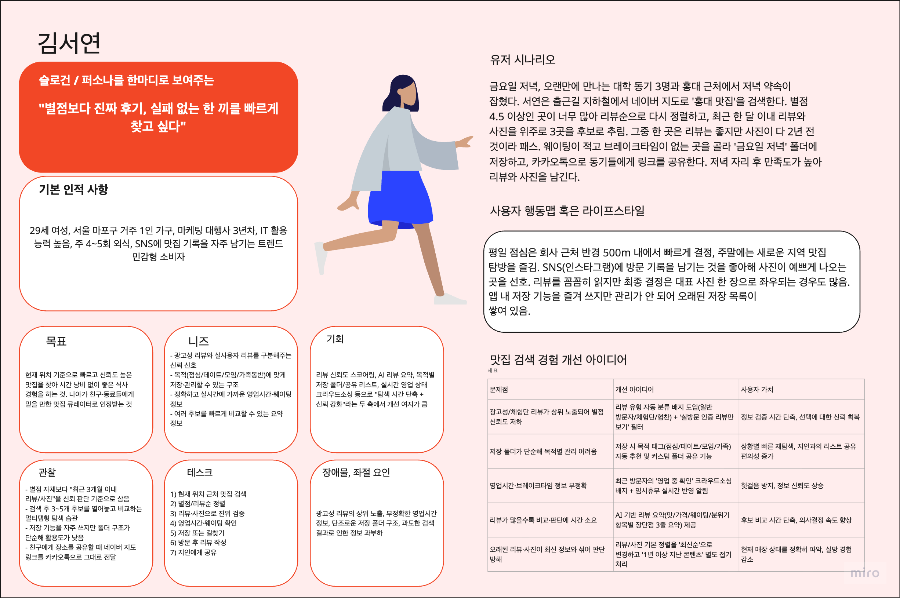

[강동7기 전Z전능 AI PM] 코멘토 청년취업사관학교 DAY 21

## DAY 21 | UX 5단계 모델부터 페르소나, 사용자 시나리오까지

오늘은 실습보다 이론 비중이 컸다. 제시 제임스 가렛의 5개 레이어, 도널드 노먼의 인지 개념과 행위의 7단계, 페르소나 설계법, 사용자 여정 지도까지 UX 기획의 뼈대가 되는 프레임워크 네 가지를 하루 만에 훑었다.

### 제시 제임스 가렛의 5개 레이어 - 추상에서 구체로

가렛의 모델은 UX 디자인이 추상적인 개념에서 시작해 점점 구체적인 결과물로 좁혀지는 5단계 과정이라고 설명한다. 가장 아래(추상)에는 사용자 니즈와 디자인 목적을 파악하는 리서치 단계가 있고, 그 위로 기능사양·콘텐츠 요구사항을 구체화하는 단계, 인터랙션과 정보구조를 설계하는 단계, 인터페이스·내비게이션·정보 디자인 단계가 쌓이고, 가장 위(구체)에 색상·폰트·그래픽 같은 비주얼 디자인이 온다. 실습으로는 Gemini Notebook의 '새로 만들기' 팝업 화면을 이 5개 레이어로 쪼개 분석해봤는데, 평소 그냥 넘겼던 팝업 하나에도 다섯 겹의 설계 결정이 쌓여있다는 게 새삼 보였다.

### 도널드 노먼의 인지 개념 - 기표, 제약, 어포던스, 매핑

기표(Signifier)는 겉으로 드러난 표식이고, 기의(Signified)는 그 표식이 머릿속에 불러일으키는 실제 의미다. 사용자가 기표만 보고도 올바른 기의를 즉각 떠올릴 수 있게 만드는 게 디자이너의 일이라고 한다.

제약(Constraint)은 잘못된 사용법 자체를 물리적으로 막아버리는 설계다. USB 커넥터가 한쪽 방향으로만 끝까지 들어가게 만들어진 게 대표 사례다.

어포던스(Affordance)는 다이얼은 돌리고 싶게, 문손잡이는 당기고 싶게, 의자는 앉고 싶게 만드는 물체 고유의 속성인데, 이건 물체 혼자만의 속성이 아니라 사용자의 지각·신체 조건에 따라 달라진다고 한다. 그리고 디자이너가 어포던스 자체를 만들어낼 수는 없고, 어포던스가 잘 발견되도록(Discoverability) 기표를 명확히 설계하고 피드백을 주는 게 디자이너의 역할이라는 설명이 인상적이었다.

매핑(Mapping)은 조작 장치와 실제 작동 결과 사이의 물리적 상응 관계다. 가스레인지 화구 배치와 다르게 생긴 일렬 밸브보다, 화구 모양 그대로 배치된 노브가 오조작을 줄인다는 예시나, 벤츠 시트 조절 버튼이 시트 모양 그대로 생겨서 설명서 없이도 직관적으로 조작되는 예시가 나왔다.

개념모델과 멘탈모델의 차이도 짚었다. 개념모델은 디자이너가 사용자가 이렇게 이해하길 바라며 설계한 구조(컴퓨터의 폴더/파일 시스템 같은)고, 멘탈모델은 사용자가 자기 경험에 기대 "이렇게 작동하겠지"라고 마음대로 추측하는 방식(화면을 스와이프하면 다음 페이지가 나올 거라는 추측 같은)이다. 이 둘이 어긋날수록 사용자는 헤매게 된다.

### 행위의 7단계 - 실행의 간격과 평가의 간격

목표를 세우고(1. Goal) → 계획하고(2. Plan) → 구체적 행동을 명세하고(3. Specification) → 실제로 수행하는(4. Execution) 앞부분이 '실행의 간격'이고, 세상에 변화가 일어난 뒤 그걸 지각하고(5. Perception) → 해석하고(6. Interpretation) → 원래 목표와 비교하는(7. Comparison) 뒷부분이 '평가의 간격'이다. 회의실에서 불을 켜는 상황을 예로 들었는데, 원하던 스위치가 아니라 엉뚱한 조명이 켜지면 지각-해석-비교 단계에서 "이건 내가 원한 게 아니다"를 감지하고 다시 새로운 목표로 루프를 돈다는 설명이 특히 와닿았다. 실습 과제는 네이버 지도로 강일역 주변 맛집을 찾는 행동을 이 7단계로 분석하고, 가장 큰 병목이 생기는 단계를 찾아 개선 아이디어를 내는 것이었다.

### 페르소나 설계 노하우

페르소나는 원래 무대 배우가 쓰는 '가면'을 뜻하는 라틴어에서 왔고, UX에서는 사용자 조사 데이터를 바탕으로 만든 가상의 대표 사용자를 말한다. 구성 요소는 기본 사항, 시나리오, 목표, 배경/계기/동기, 태도/관점, 이용 형태, 니즈 이렇게 7가지이고, 리서치 → 세그먼트 식별 → 페르소나 정의 → 문서화 → 팀 공유 → 실제 적용 → 정기 업데이트의 7단계로 만든다.

특히 기억에 남은 건 디테일 배분 비율이었다. 사용자가 처한 구체적 상황을 60~70%, 배경 환경을 10%, 니즈와 개선 포인트를 20%로 배분해야 실감 나는 페르소나가 된다는 기준이다. 그리고 단순 UI 조작 수준의 니즈와, 사용자가 인생에서 이루고 싶은 더 큰 목표(인생 목표)를 구분해서 적어야 기획의 깊이가 달라진다는 point도 새겼다.

### 사용자 여정 지도(User Journey Map)

강아지 유치원 사례로 배운 여정 지도의 5대 골자는 장면(Scene), 시나리오(Scenario), 니즈(Needs), 사용자 행동(User Action), 기능(System Function)이다. 여기에 eBay가 쓰는 7단계 공식을 더하면 실무형 여정 지도가 완성된다. 페르소나 정의 → 고객의 최종 목표 식별 → 여정 세부 단계 정의 → 고객 접점(터치포인트) 기재 → 고객의 생각과 감정 매핑(이모지 + 감정 그래프) → 감정이 급격히 떨어지는 핫스팟을 찾아 기회 요인 도출 → 이번 스프린트에서 집중할 우선순위 테마 선정까지가 한 세트다.

### 실습: 네이버 지도 맛집 찾기 페르소나 - 김서연

배운 걸 바로 적용해서 네이버 지도로 맛집을 찾는 페르소나를 만들어봤다.

29세 여성, 마포구 1인 가구, 마케팅 대행사 3년차로 IT 활용 능력이 높고 주 4~5회 외식하며 SNS에 맛집 기록을 자주 남기는 트렌드 민감형 소비자로 설정했다. 한 문장 슬로건은 "별점보다 진짜 후기, 실패 없는 한 끼를 빠르게 찾고 싶다"로 잡았다. 유저 시나리오는 오랜만에 만나는 대학 동기들과의 홍대 저녁 약속을 앞두고, 지하철에서 '홍대 맛집'을 검색해 리뷰순으로 재정렬하고 최근 한 달 이내 리뷰·사진 위주로 3곳을 추린 뒤 '금요일 저녁' 폴더에 저장해 동기들에게 카카오톡으로 공유하는 흐름으로 썼다.

목표는 위치 기준으로 빠르고 신뢰도 높은 맛집을 찾아 시간 낭비 없이 좋은 식사 경험을 하는 것, 니즈는 광고성 리뷰와 실사용자 리뷰를 구분해주는 신뢰 신호와 목적별 저장 구조였다. 관찰 포인트로는 별점 자체보다 "최근 3개월 이내 리뷰·사진"을 신뢰 판단 기준으로 삼는다는 점, 저장 기능을 자주 쓰지만 폴더 구조가 단순해 활용도가 낮다는 점을 적었고, 장애물로는 광고성 리뷰의 상위 노출과 부정확한 영업시간 정보, 과도한 검색 결과로 인한 정보 과부하를 꼽았다.

### 실습: 사용자 시나리오 - 맛집 검색 6단계 여정

김서연 페르소나를 그대로 이어서, 맛집을 검색하고 방문한 뒤 리뷰를 남기기까지의 여정을 결정 → 검색 → 후보 비교 → 방문 결정 → 이동 → 방문 후 6단계로 나눠 정리했다.

 <table style="border-collapse:collapse; min-width:1400px; width:100%; font-size:13px;"> <tr style="background:#FAEEDA;"> <th style="text-align:left; padding:10px; border:1px solid #ddd; min-width:110px;">단계</th> <th style="padding:10px; border:1px solid #ddd; min-width:210px;">1. 맛집을 가기로 결정</th> <th style="padding:10px; border:1px solid #ddd; min-width:210px;">2. 맛집 검색</th> <th style="padding:10px; border:1px solid #ddd; min-width:210px;">3. 후보 비교</th> <th style="padding:10px; border:1px solid #ddd; min-width:210px;">4. 방문 결정</th> <th style="padding:10px; border:1px solid #ddd; min-width:210px;">5. 이동</th> <th style="padding:10px; border:1px solid #ddd; min-width:210px;">6. 방문 후</th> </tr> <tr> <td style="padding:10px; border:1px solid #ddd; font-weight:600; vertical-align:top;">사용자 시나리오</td> <td style="padding:10px; border:1px solid #ddd; vertical-align:top;">나는 금요일 저녁 동기 모임 장소를 정하기 전에, 어디서 어떤 기준으로 찾을지 빠르게 판단하고 싶다.</td> <td style="padding:10px; border:1px solid #ddd; vertical-align:top;">나는 현재 위치나 목적지 근처에서 조건에 맞는 맛집 후보를 빠르게 찾고 싶다.</td> <td style="padding:10px; border:1px solid #ddd; vertical-align:top;">나는 추려진 후보 2~3곳을 리뷰, 사진, 별점으로 비교해서 가장 신뢰할 수 있는 곳을 고르고 싶다.</td> <td style="padding:10px; border:1px solid #ddd; vertical-align:top;">나는 최종 후보를 확정하고, 저장해서 동기들에게 빠르게 공유하고 싶다.</td> <td style="padding:10px; border:1px solid #ddd; vertical-align:top;">나는 예약한 장소까지 가장 빠르고 정확한 경로로 이동하고 싶다.</td> <td style="padding:10px; border:1px solid #ddd; vertical-align:top;">나는 방문 경험이 좋았다면 리뷰와 사진을 남겨서 다른 사람에게도 도움이 되고 싶다.</td> </tr> <tr style="background:#fafafa;"> <td style="padding:10px; border:1px solid #ddd; font-weight:600; vertical-align:top;">접점 방식</td> <td style="padding:10px; border:1px solid #ddd; vertical-align:top;">Mobile App · Push Notification(약속 관련 메시지) · Calendar/Message App(외부 연계)</td> <td style="padding:10px; border:1px solid #ddd; vertical-align:top;">Search · GPS · Map · Filter(가격대, 웨이팅, 주차 등)</td> <td style="padding:10px; border:1px solid #ddd; vertical-align:top;">Review · Photo · Rating · Save(임시 비교용 저장)</td> <td style="padding:10px; border:1px solid #ddd; vertical-align:top;">Save · Share(카카오톡 링크 공유) · Business Hours 확인</td> <td style="padding:10px; border:1px solid #ddd; vertical-align:top;">Navigation · GPS · Map · 대중교통/도보 경로 안내</td> <td style="padding:10px; border:1px solid #ddd; vertical-align:top;">Review 작성 · Photo 업로드 · Rating · Save(재방문용)</td> </tr> <tr> <td style="padding:10px; border:1px solid #ddd; font-weight:600; vertical-align:top;">긍정적 속마음</td> <td style="padding:10px; border:1px solid #ddd; background:#EAF3DE; vertical-align:top;">오랜만에 만나는 자리니까 좋은 곳으로 예약하고 싶다, 어차피 네이버 지도에서 찾으면 되겠지.</td> <td style="padding:10px; border:1px solid #ddd; background:#EAF3DE; vertical-align:top;">위치 기반으로 근처 맛집이 바로 뜨니까 편하다.</td> <td style="padding:10px; border:1px solid #ddd; background:#EAF3DE; vertical-align:top;">사진이 많아서 분위기를 미리 알 수 있네. 최근 리뷰를 보니까 믿을 만하다.</td> <td style="padding:10px; border:1px solid #ddd; background:#EAF3DE; vertical-align:top;">여기로 정했다, 저장해두면 나중에 또 쓸 수 있겠다.</td> <td style="padding:10px; border:1px solid #ddd; background:#EAF3DE; vertical-align:top;">길찾기가 정확해서 헤매지 않고 바로 도착할 수 있겠다.</td> <td style="padding:10px; border:1px solid #ddd; background:#EAF3DE; vertical-align:top;">좋았던 경험을 기록해서 다른 사람들한테도 도움이 됐으면 좋겠다.</td> </tr> <tr> <td style="padding:10px; border:1px solid #ddd; font-weight:600; vertical-align:top;">부정적 속마음</td> <td style="padding:10px; border:1px solid #ddd; background:#FCEBEB; vertical-align:top;">홍대는 워낙 맛집이 많아서 또 뭘 골라야 할지 고민되네.</td> <td style="padding:10px; border:1px solid #ddd; background:#FCEBEB; vertical-align:top;">검색 결과가 너무 많아서 뭐부터 봐야 할지 모르겠어. 필터링을 더 세밀하게 하고 싶은데 한계가 있네.</td> <td style="padding:10px; border:1px solid #ddd; background:#FCEBEB; vertical-align:top;">광고가 너무 많아서 뭘 믿어야 할지 모르겠어. 사진이 다 2년 전 거라 지금이랑 다를 것 같은데.</td> <td style="padding:10px; border:1px solid #ddd; background:#FCEBEB; vertical-align:top;">영업시간이 진짜 맞는지 불안하다. 저장은 하는데 나중에 폴더에서 못 찾을 것 같아.</td> <td style="padding:10px; border:1px solid #ddd; background:#FCEBEB; vertical-align:top;">주차 정보가 없어서 도착해서야 주차할 곳을 찾아야 하네.</td> <td style="padding:10px; border:1px solid #ddd; background:#FCEBEB; vertical-align:top;">리뷰 쓰는 과정이 번거로워서 그냥 넘어갈까 싶다.</td> </tr> <tr style="background:#fafafa;"> <td style="padding:10px; border:1px solid #ddd; font-weight:600; vertical-align:top;">감정 변화</td> <td style="padding:10px; border:1px solid #ddd; vertical-align:top;">🙂 익숙한 앱을 열면 된다는 확신은 있지만 아직 구체적 정보 탐색 전이라 기대와 약간의 부담이 공존.</td> <td style="padding:10px; border:1px solid #ddd; vertical-align:top;">😐 검색 자체는 빠르지만 결과가 많아 아직 판단 기준이 서지 않은 상태.</td> <td style="padding:10px; border:1px solid #ddd; vertical-align:top;">😫 여러 탭을 오가며 비교하는 과정에서 시간 소모와 신뢰 저하가 동시에 발생, 이 단계에서 감정이 가장 크게 떨어짐.</td> <td style="padding:10px; border:1px solid #ddd; vertical-align:top;">🙂 결정을 내렸다는 안도감은 있지만, 영업시간 신뢰도와 저장 관리에 대한 불안이 남아 완전한 만족은 아님.</td> <td style="padding:10px; border:1px solid #ddd; vertical-align:top;">🙂 길찾기 자체는 안정적이라 감정이 회복되는 구간이지만, 주차·웨이팅 등 도착 직전 정보 공백이 아쉬움으로 남음.</td> <td style="padding:10px; border:1px solid #ddd; vertical-align:top;">😄 실제 방문이 기대에 부합했을 경우 여정 전체에서 가장 긍정적인 감정으로 마무리되며, 리뷰 작성 의향으로 이어짐.</td> </tr> <tr> <td style="padding:10px; border:1px solid #ddd; font-weight:600; vertical-align:top;">니즈 / 인사이트</td> <td style="padding:10px; border:1px solid #ddd; vertical-align:top;">검색을 시작하기 전부터 실패하면 안 된다는 부담이 존재한다. 익숙한 앱(네이버 지도)을 자동으로 선택하는 습관이 형성되어 있다.</td> <td style="padding:10px; border:1px solid #ddd; vertical-align:top;">검색 결과가 많을수록 초기 필터링(정렬 기준)이 선택의 질을 좌우한다. 위치 기반 편의성은 만족하지만, 조건별 세부 필터에 대한 니즈가 크다.</td> <td style="padding:10px; border:1px solid #ddd; vertical-align:top;">최근 리뷰·사진을 더 신뢰하는 경향이 뚜렷하다. 비교 과정에서 여러 탭을 오가며 시간이 오래 걸린다. 광고성 리뷰와 실사용자 리뷰가 구분되지 않아 신뢰 판단에 부담이 크다.</td> <td style="padding:10px; border:1px solid #ddd; vertical-align:top;">결정 후 바로 지인과 공유하는 행동이 자연스럽게 이어진다. 저장 폴더가 목적별로 구분되지 않아 재탐색 시 비효율이 발생한다. 영업시간 정보의 실시간성에 대한 불신이 결정 단계까지 영향을 미친다.</td> <td style="padding:10px; border:1px solid #ddd; vertical-align:top;">길찾기 정확도에 대한 신뢰는 높은 편이다. 도착 직전 실질적 정보(주차, 대기 상황)에 대한 니즈가 충족되지 않는다.</td> <td style="padding:10px; border:1px solid #ddd; vertical-align:top;">만족스러운 경험은 자발적 리뷰/사진 공유로 이어지는 선순환 구조를 만든다. 리뷰 작성 과정이 번거로우면 이탈이 발생해 신뢰할 수 있는 리뷰 총량이 줄어든다.</td> </tr> <tr style="background:#fafafa;"> <td style="padding:10px; border:1px solid #ddd; font-weight:600; vertical-align:top;">창의적 도전(HMW)</td> <td style="padding:10px; border:1px solid #ddd; background:#E6F1FB; vertical-align:top;">사용자가 검색 시작 전부터 목적(모임 인원, 상황)에 맞는 탐색을 쉽게 시작하도록 도울 수 있을까?</td> <td style="padding:10px; border:1px solid #ddd; background:#E6F1FB; vertical-align:top;">사용자가 방대한 검색 결과에서 자신의 목적에 맞는 후보로 빠르게 좁힐 수 있게 도울 수 있을까?</td> <td style="padding:10px; border:1px solid #ddd; background:#E6F1FB; vertical-align:top;">사용자가 광고성 리뷰를 쉽게 구분하도록 도울 수 있을까? 여러 맛집을 한 화면에서 쉽게 비교하도록 만들 수 있을까?</td> <td style="padding:10px; border:1px solid #ddd; background:#E6F1FB; vertical-align:top;">사용자가 저장한 장소를 목적에 맞게 쉽게 관리하고 다시 찾도록 도울 수 있을까? 영업시간 정보를 더 신뢰할 수 있게 만들 수 있을까?</td> <td style="padding:10px; border:1px solid #ddd; background:#E6F1FB; vertical-align:top;">이동 중에도 도착 후 상황(웨이팅, 주차)을 미리 알 수 있게 할 수 있을까?</td> <td style="padding:10px; border:1px solid #ddd; background:#E6F1FB; vertical-align:top;">방문 후 리뷰 작성 과정을 더 쉽고 빠르게 만들 수 있을까?</td> </tr> <tr> <td style="padding:10px; border:1px solid #ddd; font-weight:600; vertical-align:top;">필요한 기능</td> <td style="padding:10px; border:1px solid #ddd; vertical-align:top;">최근 검색/저장 이력 기반 빠른 진입(예: 홍대 모임 최근 검색 카드), 상황별 추천 진입점(점심/데이트/모임 탭)</td> <td style="padding:10px; border:1px solid #ddd; vertical-align:top;">목적 기반 스마트 필터(모임 인원수, 예산, 웨이팅 여부), AI 맛집 추천(과거 저장/방문 이력 기반)</td> <td style="padding:10px; border:1px solid #ddd; vertical-align:top;">리뷰 유형 자동 분류 배지(일반/체험단/협찬), AI 리뷰 요약(맛/가격/웨이팅/분위기 3줄 요약), 비교 리스트, 최근 리뷰 우선 보기(기본 정렬 최신순)</td> <td style="padding:10px; border:1px solid #ddd; vertical-align:top;">목적별 저장 폴더/태그(점심/데이트/모임/가족) + 공유 가능한 리스트, 크라우드소싱 영업 상태 배지(최근 방문자 확인 기반)</td> <td style="padding:10px; border:1px solid #ddd; vertical-align:top;">실시간 웨이팅/혼잡도 표시, 주변 주차장 정보 연동</td> <td style="padding:10px; border:1px solid #ddd; vertical-align:top;">원탭 리뷰 작성(별점+사진만으로 간편 등록, 텍스트는 선택), 친구 취향 기반 추천에 반영되는 개인화 리뷰 히스토리</td> </tr> </table> 

여정 지도를 다 채우고 나서 핵심 Pain Point, Insight, 우선순위 개선 아이디어를 각각 5개씩 뽑았다.

**핵심 Pain Point 5개**

1. 광고성/체험단 리뷰가 필터링 없이 노출되어 후보 비교 단계에서 신뢰가 크게 저하된다.
2. 검색 결과가 과도하게 많아 초기 필터링 없이는 판단 기준을 잡기 어렵다.
3. 저장 폴더 구조가 단순해 목적별 관리와 재탐색이 비효율적이다.
4. 영업시간·브레이크타임 정보의 실시간성이 낮아 방문 결정 단계에서 불안을 유발한다.
5. 도착 직전 실질 정보(주차, 웨이팅)가 부족해 이동 단계 만족도가 완전히 회복되지 못한다.

**핵심 Insight 5개**

1. 사용자는 별점보다 "최근 3개월 이내 리뷰·사진"을 신뢰 판단의 핵심 기준으로 삼는다.
2. 여정 전체에서 감정이 가장 낮아지는 지점은 '후보 비교' 단계이며, 이는 정보 신뢰도 문제에서 비롯된다.
3. 결정 이후 지인 공유 행동이 자연스럽게 이어지므로, 공유 가능한 저장 구조가 곧 확산 채널이 될 수 있다.
4. 만족스러운 방문 경험은 자발적 리뷰 생성으로 이어지는 선순환을 만들지만, 작성 과정의 번거로움이 병목이다.
5. 길찾기(이동 단계)는 이미 신뢰도가 높은 영역이므로, 개선 우선순위는 비교·결정 단계에 집중하는 것이 효율적이다.

**우선순위가 높은 개선 아이디어 5개**

1. 리뷰 유형 자동 분류 배지 + 실방문 인증 필터 — 후보 비교 단계의 가장 큰 신뢰 붕괴 지점을 직접 해결.
2. AI 리뷰 요약(맛/가격/웨이팅/분위기 3줄 요약) — 비교 시간 단축과 판단 속도 향상, Pain Point 2·3 동시 완화.
3. 목적별 저장 폴더 + 공유 가능한 리스트 — 방문 결정 단계의 관리 비효율을 해소하고, 지인 공유라는 자연스러운 행동을 강화.
4. 크라우드소싱 영업 상태 배지 — 영업시간 신뢰도 문제를 실시간 사용자 확인으로 보완, 헛걸음 방지.
5. 원탭 리뷰 작성(별점+사진 간편 등록) — 방문 후 단계의 리뷰 작성 장벽을 낮춰 신뢰할 수 있는 리뷰 총량 자체를 늘리는 근본적 해결책.

#취업 #부트캠프 #청년취업사관학교 #새싹 #AIPM #DX교육 #AI교육 #실무프로젝트 #실무경험 #취업포트폴리오 #포트폴리오 #전Z전능 #코멘토 #모비니티
