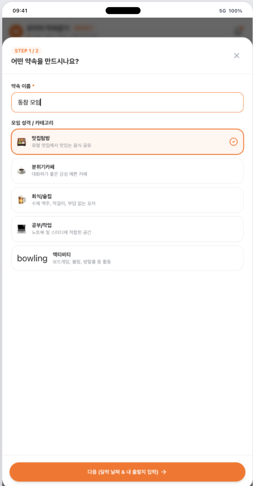
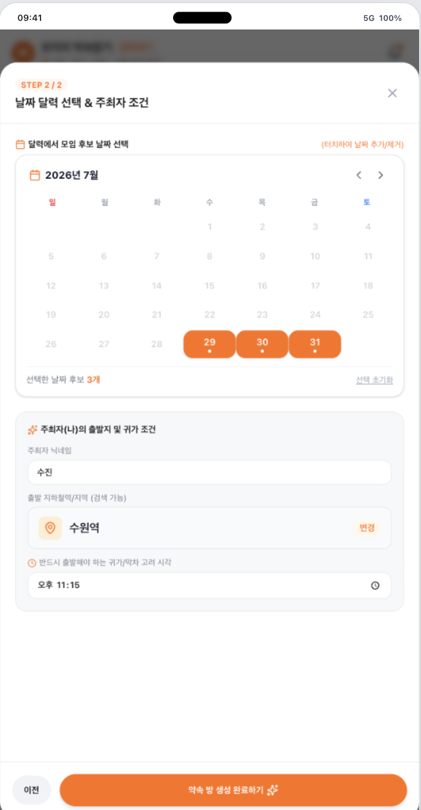
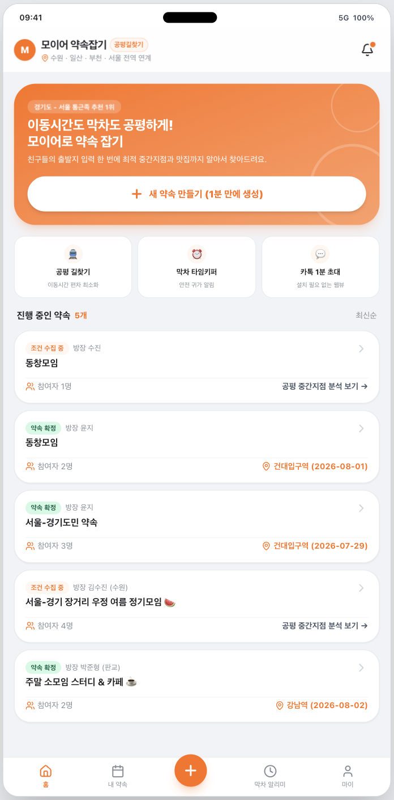
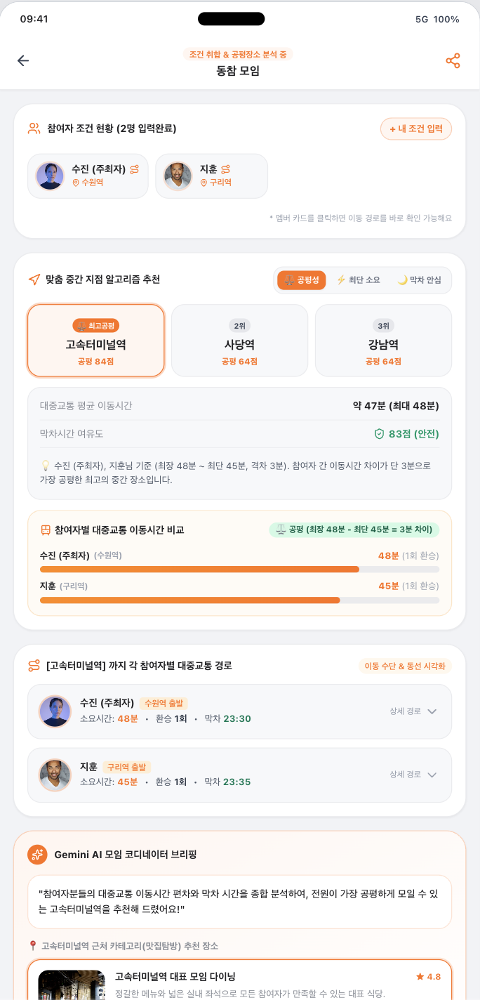
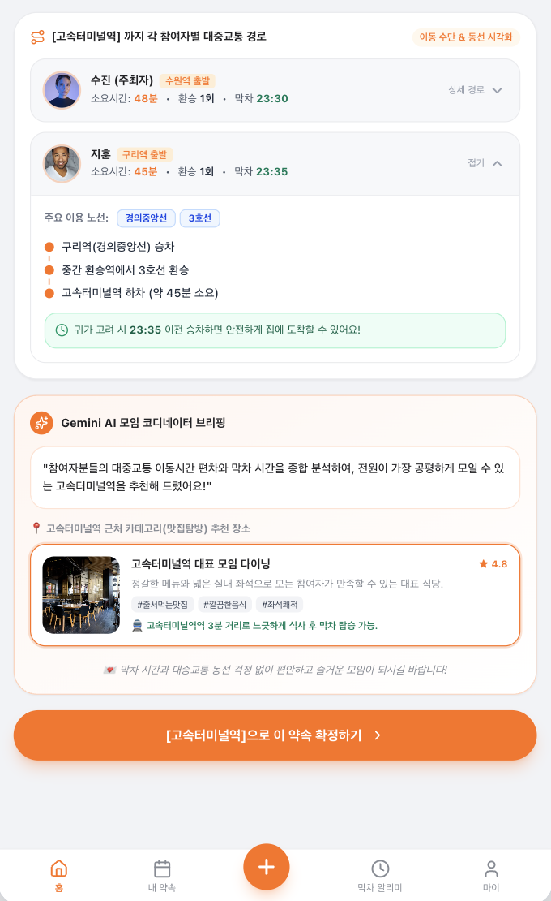
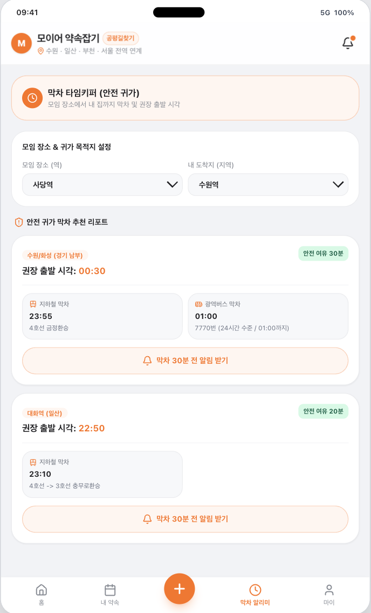

[강동7기 전Z전능 AI PM] 코멘토 청년취업사관학교 DAY 23

## DAY 23 | 바이브 코딩으로 경기도민의 슬픔 해소하기

오늘은 바이브 코딩(Vibe Coding) 입문 강의였다. 코드를 직접 짜는 대신 자연어로 원하는 것을 설명해서 AI가 소프트웨어를 만들게 하는 방식인데, 실습에서는 Google AI Studio의 Build 모드로 그동안 준비해온 약속 잡기 서비스 "모이어"의 PRD를 직접 프로토타입으로 만들어봤다.

### 바이브 코딩이라는 새로운 개발 방식

| 구분        | 기존 코딩                        | 바이브 코딩                        |
| ----------- | -------------------------------- | ---------------------------------- |
| 입력        | 코드                             | 자연어                             |
| 필요한 역량 | 프로그래밍 언어, 프레임워크 지식 | 원하는 결과를 명확히 설명하는 능력 |
| 제작자      | 개발자 중심                      | 누구나 가능                        |
| 첫 결과     | 며칠~몇 주                       | 몇 분                              |
| 수정 방식   | 코드 분석 후 수정                | 에러/요구사항 전달 후 수정         |

이 변화가 지금 일어나는 이유로는 AI 모델이 실제 동작하는 코드를 생성할 수준까지 좋아진 것, 작성·실행·미리보기·배포가 한 환경 안에서 다 되도록 도구가 통합된 것, 무료 또는 낮은 비용으로 누구나 시작할 수 있게 된 것 세 가지를 짚었다.

### PM에게는 "설명하는 기획"에서 "보여주는 기획"으로

기존 PM은 아이디어를 기획서로 옮기고, 개발자를 설득하고, 리소스를 기다린 뒤에야 첫 화면을 볼 수 있었다. 그 사이에 "아, 이게 아닌데" 하는 순간이 자주 생긴다. 바이브 코딩 이후에는 아이디어를 AI에게 설명하면 10분 뒤 동작하는 화면을 보고 바로 수정 요청을 할 수 있다. PM이 활용할 수 있는 영역으로는 프로토타입 제작, 개발팀에 요청하기 애매한 내부 업무 도구 제작, 큰 개발 비용을 들이기 전에 기능 사용 여부를 확인하는 가설 검증 세 가지가 제시됐다.

다만 강의에서 강조한 건 "코드를 몰라도 된다"가 "개발 지식이 필요 없다"는 뜻은 아니라는 점이었다. 코드를 직접 작성하지 않아도 되지만, 무엇을 만들고 있는지는 알아야 한다는 것. AI가 만든 결과가 논리적으로 맞는지, 사용자 문제를 해결하는지, 보안 문제는 없는지 검증하는 건 여전히 사람의 몫이다. 그리고 좋은 프롬프트의 구조도 결국 목표 → 사용자 → 문제 상황 → 필요한 기능 → 제약 조건 → 원하는 결과물로, PM이 쓰는 PRD 구조와 그대로 겹친다.

### 실습, Google AI Studio Build 모드로 프로토타입 만들기

Google AI Studio는 설치 없이 구글 계정만 있으면 바로 쓸 수 있는 브라우저 기반 AI 개발 환경이다. Build 모드는 원하는 앱을 문장으로 설명하면 화면 생성부터 기능 구현, 실행 확인까지 한 번에 처리해준다. 오늘 실습은 미리 정해진 대상이 있던 게 아니라, 주제 설정부터 문제 정의, 프로토타입 제작까지 전부 스스로 해보는 방식이었다.

주제는 경기도민으로 살면서 겪은 장거리 이동과 막차 시간의 설움에서 잡았다. 문제는 두 가지로 정의했다. 하나는 물리적 거리만 보고 중간지점을 잡다 보니 경기도권 등 특정 참석자만 환승이 잦거나 막차 시간이 짧아지는 불공평이고, 다른 하나는 단톡방 안에서 일정 투표·지도 캡처·예약 링크가 뒤섞여 정작 확정까지 시간이 오래 걸리는 파편화된 소통이었다.

두 번째 문제부터 풀었다. 단톡방을 오가는 대신 약속 이름과 성격만 고르면 바로 방이 만들어지도록 잡았고,

날짜 후보와 주최자의 출발지·귀가 시각까지 한 화면에서 받도록 해서, 여기저기 흩어져 있던 정보를 앱 하나로 모으려 했다.

이렇게 만든 서비스가 "모여라"다. 완성된 홈 화면은 이렇게 나왔다.

첫 번째 문제, 그러니까 불공평한 이동시간은 핵심 알고리즘으로 풀려고 했다. 물리적 중간지점 대신 이동시간 편차·환승 횟수·막차 시간까지 종합해서 계산하게 만들어서, 참여자 중 누구도 유독 손해 보지 않는 지역을 추천하는 게 목표였다.

다만 만들고나니, 공평성을 어느정도 포기하고 최단 시간을 원하는 유저도 있을 것 같아 공평성, 최단소요, 막차 안심으로 나눠서 추천해주도록 했다.

막차 시간이 짧아지는 문제도 추천 한 번으로 끝내지 않았다. 약속 장소가 정해진 뒤에도 각자 집까지 안전하게 갈 수 있도록 권장 출발 시각과 막차 알림을 따로 챙기는 화면을 만들었다.

기획서만 들고 개발팀을 설득하던 방식과 다르게, 문제 정의부터 기능까지 이 흐름을 AI Studio에 그대로 설명해서 실제로 동작하는 화면까지 바로 확인해볼 수 있었던 게 오늘 실습의 핵심이었다.

### 프로토타입 만든 뒤, 사용자 인터뷰까지

화면을 만들고 나서 바로 사용자 인터뷰를 진행했다. 목표는 두 가지였다. 중간역 추천 결과(이동시간, 공평성, 환승 횟수)를 사용자가 얼마나 신뢰하는지, 그리고 약속 생성부터 장소 확정까지 흐름에서 어디가 막히는지 확인하는 것.

서비스 이해도부터 물었더니 "멀리 있는 사람들과 약속 잡을 때 만나는 장소를 공평하게 알려주는 서비스"라고 정확하게 짚었다. 다만 공평성 점수와 이동시간 비교 차트는 70점 정도, 그러니까 이해는 되지만 완전히 직관적이지는 않다는 평가였다. 실제로 써볼 의향은 있다고 했고, 가장 편리했던 기능으로는 맞춤 중간 지점 알고리즘 추천을 꼽았다.

아쉬운 점으로는 주변 맛집·카페 추천 개수를 더 늘려줬으면 좋겠다는 것과, 지하철 이동시간이 실제 API로 연동됐으면 좋겠다는 의견이 나왔다. 추가로 원하는 정보로는 주차 여부, 그리고 예약한 가게가 문을 닫았을 때 이용할 대안 장소 추천이 나왔다. 이 두 번째 의견은 장소가 확정된 이후, 그러니까 그다음 단계의 예외 상황까지 고려한 답변이라 서비스의 스코프를 다시 생각하게 만들었다.

정리하면서 든 생각은, 사용자가 필요로 하는 건 중간역 추천 자체보다 그 이후의 실행 단계라는 점이었다. 지하철 이동시간을 실제 API로 연동하는 것도 알고리즘을 정교하게 만드는 문제라기보다, 서비스 신뢰도 자체를 좌우하는 문제라는 걸 확인했다. 가장 먼저 개선하고 싶은 건 지하철 이동시간 API 연동이고, 그다음이 주변 장소 추천 개수 확대와 휴무 시 대안 추천 로직이다.

#취업 #부트캠프 #청년취업사관학교 #새싹 #AIPM #DX교육 #AI교육 #실무프로젝트 #실무경험 #취업포트폴리오 #포트폴리오 #전Z전능 #코멘토 #모비니티
