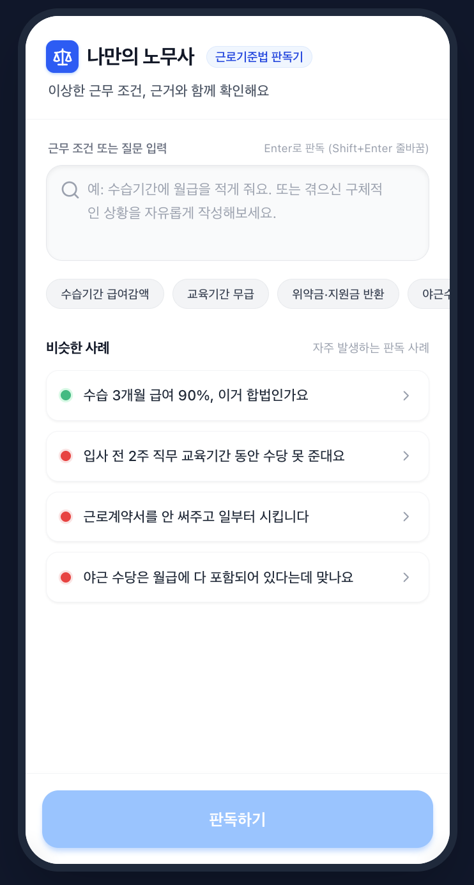
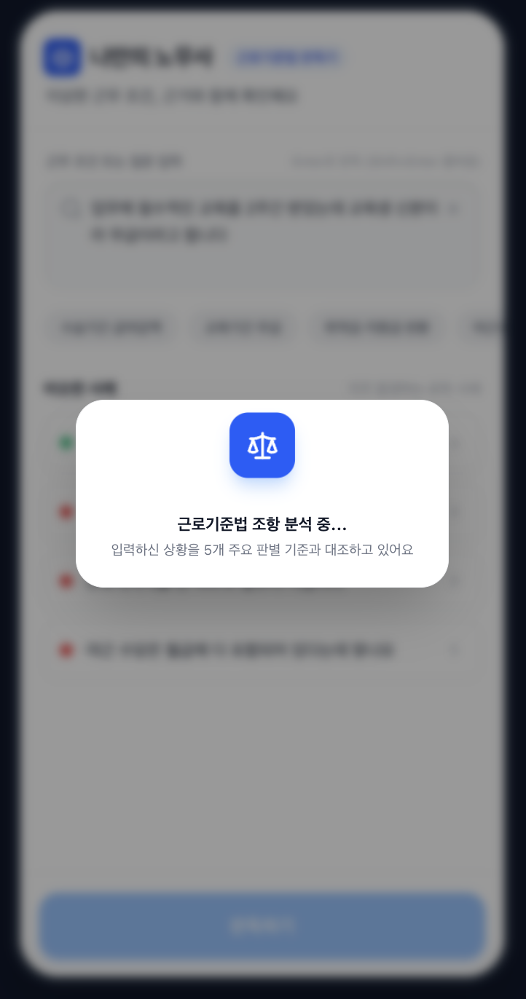
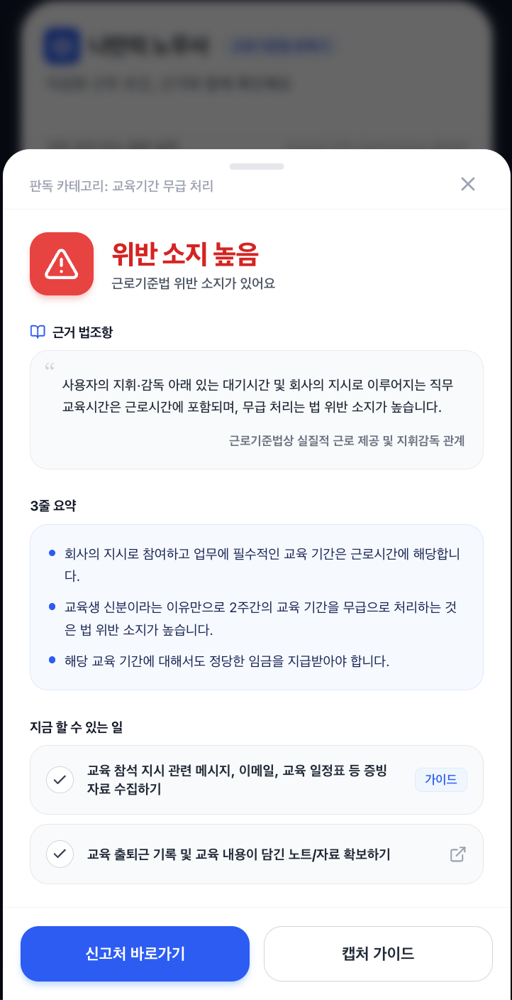

[강동7기 전Z전능 AI PM] 코멘토 청년취업사관학교 DAY 26

## DAY 26 | 바이브코딩 프로젝트 1일차

오늘부터 4일간 이어지는 바이브코딩 프로젝트가 시작됐다. Google Antigravity라는 새 도구를 배우고, 그 도구로 포트폴리오 자기소개 페이지부터 만들어본 다음, 4일 동안 진행할 개인 프로젝트 주제를 정하고 AI Studio로 초안까지 만드는 게 오늘의 목표였다.

### 4일의 로드맵과 솔로 프로젝트로 가는 이유

| 일차  | 내용                                                 |
| ----- | ---------------------------------------------------- |
| Day 1 | 도구 익히기, 프로젝트 주제 선정, AI Studio 초안 생성 |
| Day 2 | 본격적인 바이브코딩, 프로젝트 개발 시작              |
| Day 3 | 배포(Vercel), 사용자 인터뷰, 피드백 수집             |
| Day 4 | 개선, 최종 발표                                      |

이번엔 팀이 아니라 개인 프로젝트로 진행한다. 팀 프로젝트는 일부 인원만 실제 개발 경험을 하게 되는 경우가 많다는 이유였다. 대신 데일리 스크럼, 50분 집중 스프린트, 매일 미니 데모로 운영 리듬을 잡고, "30분 이상 혼자 고민하지 않는다"는 규칙을 정했다. 막히면 손을 들고 질문해서 같이 해결하는 쪽이 시간을 아낀다는 것.

### Google Antigravity

Google의 AI 에이전트 개발 도구다. 자연어로 요청하면 AI가 코드를 쓰고, 수정하고, 실행까지 한다. 강조된 건 코드를 작성하는 사람이 아니라 무엇을 만들지 정의하는 사람이 되는 것이라는 점. 화면은 크게 세 가지로 나뉜다. AI에게 작업을 요청하는 Agent 채팅창, AI가 작성한 코드를 확인하는 에디터(코드를 몰라도 된다), 이미지와 파일을 관리하는 파일 탐색기.

작업 방식은 프롬프트 작성 → AI 생성 → 결과 확인 → 수정 요청 → 반복, 이 사이클을 계속 도는 것이다. 중요한 건 코드를 직접 고치지 않고 AI에게 수정을 요청한다는 점이었다.

### 좋은 결과는 좋은 재료에서 나온다

좋은 결과는 좋은 프롬프트보다 좋은 재료에서 나온다는 이야기가 인상적이었다. 필요한 재료는 두 가지, 원하는 디자인을 보여주는 레퍼런스 이미지와 이름·소개·기능 같은 내용을 미리 구조화해둔 텍스트다. 이 둘을 함께 주면 훨씬 좋은 결과가 나온다.

### 프로젝트 주제, "나만의 노무사" 초안 만들기

4일짜리 프로젝트 주제는 내가 실제로 겪은 불편에서 출발하라고 했다. 템플릿은 "누가, 어떤 상황에서, 무엇을 하도록 돕는 웹서비스, 핵심 기능은 딱 1개"였고, 화면 3개 이하·핵심 기능 1개·보조 기능 2개 이하·1분 안에 데모 가능이라는 조건, 소셜 로그인·결제·승인 필요한 외부 API·모바일 앱은 제외라는 제약이 붙었다.

이 조건에 맞춰 정한 주제가 "나만의 노무사"다. 최근 한 달 안에 직접 겪은 불편은 마땅히 없어서, 대신 사회초년생 시절에 스스로 어떤 게 유독 힘들었는지를 다시 떠올려보는 데서 출발했다. 예를 들면 교육 기간이라는 이유로 임금이 제대로 나오지 않거나, 회사가 지원해준 비용을 퇴사할 때 위약금처럼 반환해야 하는 경우처럼, 이게 불법인지 그냥 업계 관행인지 확신이 서지 않는 애매한 상황들이다. 노무사 상담을 받기엔 심리적·시간적 허들이 높다는 것도 문제였다. 그래서 타겟은 회사와 대립하긴 부담스럽지만 손해를 보고 있는지는 조용히 빠르게 확인하고 싶어하는 사회초년생으로 잡았다.

핵심 기능은 조건부 문답형 근무 조건 판독기다. 사용자가 상황을 자연어로 입력하면, 수습기간 급여 감액·교육기간 무급 처리·위약금 및 지원금 반환 조항·연장 및 야근수당 미지급·근로계약서 미작성 및 미교부, 이 5개 카테고리 안에서만 판별하고 범위 밖 입력은 "판단 보류, 노무 상담 권장"으로 안내한다. 각 카테고리의 근거 법조항은 프롬프트에 고정으로 삽입해서(RAG 방식) LLM이 임의로 새 법 해석을 만들어내지 않도록 통제했다. 최종 결과는 빨강(위반 소지 높음)과 초록(합법 소지 높음) 둘 중 하나로만 보여주고, 노랑은 최종 결과가 아니라 "정보가 더 필요합니다"를 뜻하는 임시 상태로만 쓴다. 이 상태일 때만 후속 질문을 한 번 띄우는데, 예를 들어 위약금·지원금 반환 카테고리는 반환 대상이 실비인지 위약금 명목인지에 따라 결과가 갈리기 때문에 후속 질문이 꼭 필요하다.

보조 기능은 두 개다. 자주 묻는 상황을 태그로 보여주고 다른 사람들의 유사 사례를 피드로 노출하는 추천 칩, 그리고 빨간불이 떴을 때 카톡·문자 증거를 캡처해두라거나 고용노동부 신고처 링크를 안내하는 원액션 대처 가이드. 1분 데모는 "퇴사하면 지원받은 비용을 위약금으로 반환하래"라는 고정 문장을 입력하면 후속 질문 모달이 뜨고, '위약금 명목'을 선택하면 근로기준법 제20조(위약 예정의 금지) 근거와 함께 빨간불 결과와 대처 가이드가 나오는 흐름으로 짰다. 화면은 페이지 라우팅 없이 메인·후속 질문 모달·결과 바텀시트, 이렇게 3개로 SPA 구조를 잡았다.

 

 

 

 

### 마무리

오늘 배운 걸 정리하면, AI에게 일을 시키는 법을 익히고, 좋은 재료를 먼저 준비하고, 혼자 붙들고 있지 않고, 프로젝트는 작게 시작해서 핵심 기능 하나에 집중하는 것이었다. 오늘 목표는 완성이 아니라 초안이라는 말대로, 주제와 구조를 확정한 데서 1일차를 마무리했다.

#취업 #부트캠프 #청년취업사관학교 #새싹 #AIPM #DX교육 #AI교육 #실무프로젝트 #실무경험 #취업포트폴리오 #포트폴리오 #전Z전능 #코멘토 #모비니티
