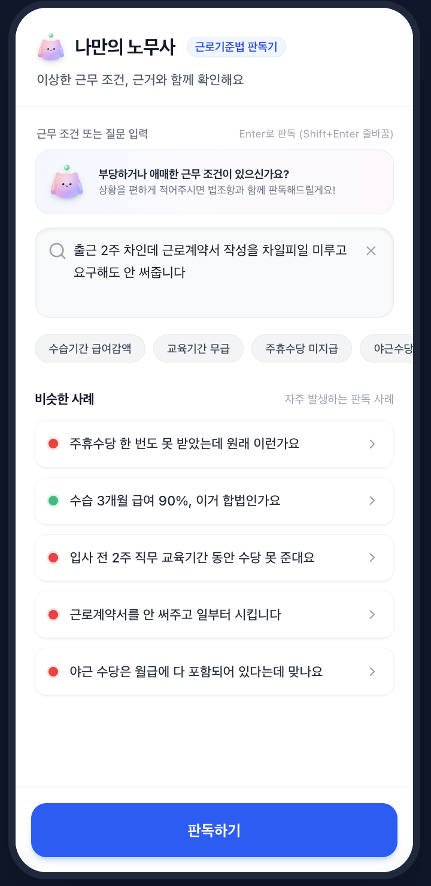
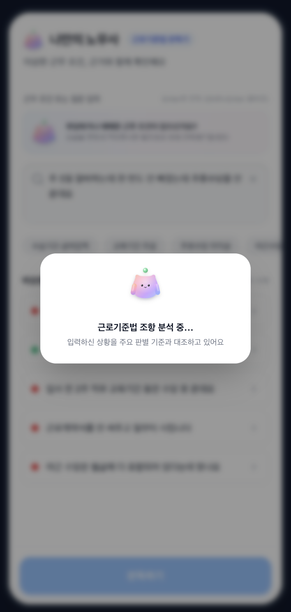
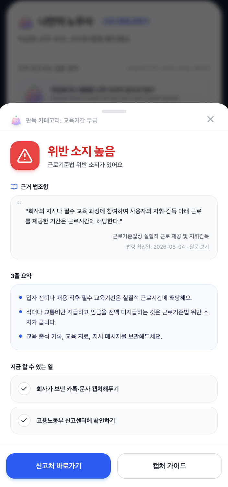

[강동7기 전Z전능 AI PM] 코멘토 청년취업사관학교 DAY 27

## DAY 27 | 바이브코딩 프로젝트 2일차

어제 뼈대를 잡았던 "나만의 노무사"를 실제로 써봐도 이상하지 않은 수준으로 고도화하는 하루였다. 어제까지는 Antigravity로 초안을 만들었는데, 오늘부터는 이미 있는 코드베이스를 계속 다듬어야 해서 Claude Code로 넘어왔다. 예전에 정리해뒀던 그 구분, AI Studio는 아이디어를 빠르게 검증하는 도구고 Claude Code는 기존 코드베이스를 유지·확장하는 도구라는 게 오늘 그대로 맞아떨어졌다. 기능을 더 얹기보다 있는 기능을 제대로 돌아가게 만드는 데 시간을 더 썼다.

### 토큰을 아끼는 법

추천 칩으로 노출하는 5개 사례는 어차피 실제 빈도가 검증된 대표 사례라, 매번 AI를 다시 호출할 필요가 없다고 판단했다. 그래서 이 5개는 클릭하는 순간 사전 검증된 정적 응답(`STATIC_CHIP_RESULTS`)을 즉시 돌려주도록 바꾸고, 사용자가 직접 자유롭게 입력하거나 비슷한 사례를 고르는 경우에만 실시간 AI 판독을 그대로 유지했다. 뻔한 답을 매번 AI에게 다시 묻지 않는 것만으로도 비용과 응답 속도를 같이 잡을 수 있었다.

### 법적 근거의 신뢰성

법조항 텍스트가 시스템 프롬프트, 로컬 폴백, 프론트 화면 이렇게 세 군데에 흩어져 있던 걸 `lawReferences.ts` 하나로 합쳤다. 세 군데가 각자 다른 버전의 법조항을 참조하고 있으면 나중에 조항이 개정됐을 때 어딘가는 반드시 놓치게 된다. 여기에 `sourceUrl`과 `lastVerifiedDate` 필드를 추가해서, 결과 화면에 "법령 확인일 · 원문 보기"를 노출하도록 했다. 신호등 색깔만 보여주고 끝나는 게 아니라, 그 판정의 근거를 사용자가 직접 검증할 수 있게 열어둔 것이다.

### 카테고리 하나를 교체하다

MVP 5개 카테고리 중 "위약금·지원금 반환"을 리서치해보니, 청년 노동인권 실태조사 등을 봤을 때 실제로 사회초년생이 흔히 겪는 이슈는 아니었다. 반면 나머지 네 개(수습기간 급여 감액, 교육기간 무급 처리, 연장·야근수당 미지급, 근로계약서 미작성)는 근거가 확인됐다. 그래서 위약금·지원금 반환 자리를 근로기준법 제55조 기준의 주휴수당 미지급으로 바꿨다. 어제 정한 카테고리라도 실제 데이터로 검증했을 때 안 맞으면 바로 빼는 게 맞다고 판단했다.

### 데모용 지름길을 걷어내다

발표를 위해 만들어뒀던 하드코딩 데모 분기를 서버와 프론트 코드 전반에서 전부 제거했다. 이제는 어떤 입력이 들어와도 실제 Gemini 파이프라인이나 로컬 폴백을 그대로 타도록 통일했다. 데모 때만 그럴듯하게 보이고 실제로는 안 돌아가는 상태로 남겨두고 싶지 않았다.

### 마스코트를 붙이다

마스코트 컴포넌트를 새로 만들어서 헤더, 검색 입력창, 후속 질문 모달, 결과 바텀시트, 로딩 화면까지 다섯 군데에 배치했다. 신호등이라는 다소 딱딱한 판정 결과를 계속 마주해야 하는 화면이라, 어디에서나 눈에 띄는 캐릭터 하나를 붙여서 톤을 조금 누그러뜨리고 싶었다.

디자인을 잡는 과정에서 웃긴 일도 있었다. 동그란 마스코트 형태를 만들어두고 "이 형태에 옷만 입혀줘"라고 요청했더니, 몸통 전체가 정장 입은 사람 형태로 바뀌고 원래 마스코트는 머리 위에 떠 있는 작은 파란 공 하나로 쪼그라들어서 나왔다.

"옷만"이라는 말을 몸 전체를 사람처럼 다시 그리라는 뜻으로 받아들인 모양이었다. 결국 이 결과는 버리고 원래 형태를 유지한 채로 다시 요청해서 지금 쓰는 버전을 얻었다.

### 오늘 막혔던 것들

AI Studio에 프롬프트를 꼼꼼하게 써서 요청했는데도, 막상 코드를 열어보니 빠져 있는 부분들이 있었다. 프롬프트만으로는 다 잡히지 않는 지점들을 하나씩 발견하고 정의해가며 고쳐나간 하루였다.

가장 크게 걸린 건 시스템 프롬프트가 "5개 카테고리 밖이면 무조건 초록불"로 강제하고 있었다는 점이었다. 그래서 "월급을 3개월째 못 받았다"처럼 명백한 임금체불조차 "합법"으로 잘못 판정되고 있었다. 카테고리 밖이라고 무조건 안전 판정을 내리는 대신, 노동법과 관련된 상황이면 AI가 직접 관련 법조항을 찾아서 판단하도록 규칙을 고쳤다.

결과 화면의 대처 가이드 체크리스트도 마찬가지였다. 체크리스트 항목이 배열 순서(0번/1번)로 특정 모달에 고정 연결되어 있어서, AI가 생성하는 문구 순서가 바뀌면 캡처 가이드를 눌렀는데 노동부 안내 모달이 열리는 식으로 엉뚱하게 연결됐다. 체크리스트는 클릭할 수 없는 순수 텍스트로 바꾸고, 실제 액션은 하단에 고정된 버튼 2개로만 접근하도록 정리했다.

### 오늘까지의 작업본

 

 

 

 

#취업 #부트캠프 #청년취업사관학교 #새싹 #AIPM #DX교육 #AI교육 #실무프로젝트 #실무경험 #취업포트폴리오 #포트폴리오 #전Z전능 #코멘토 #모비니티
