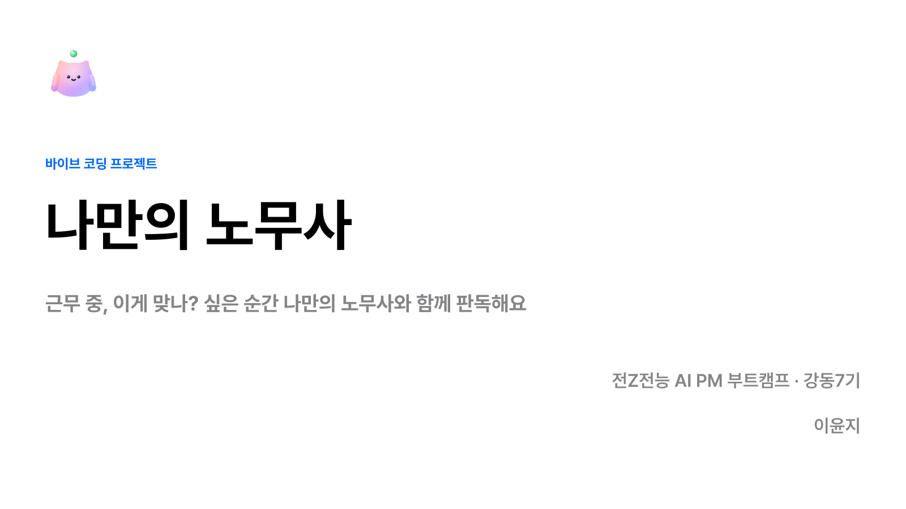
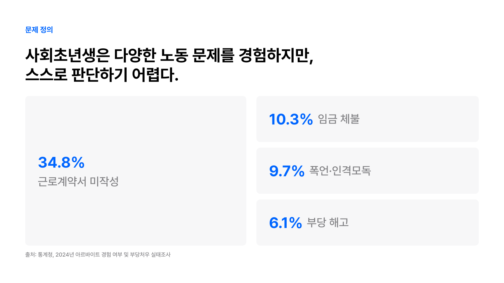
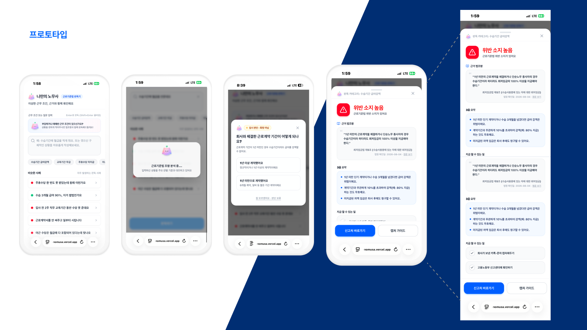
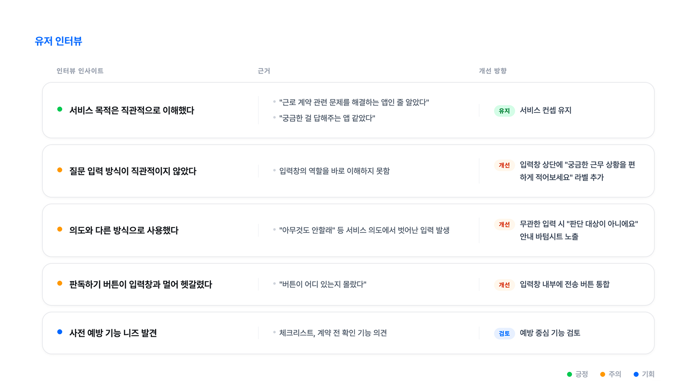
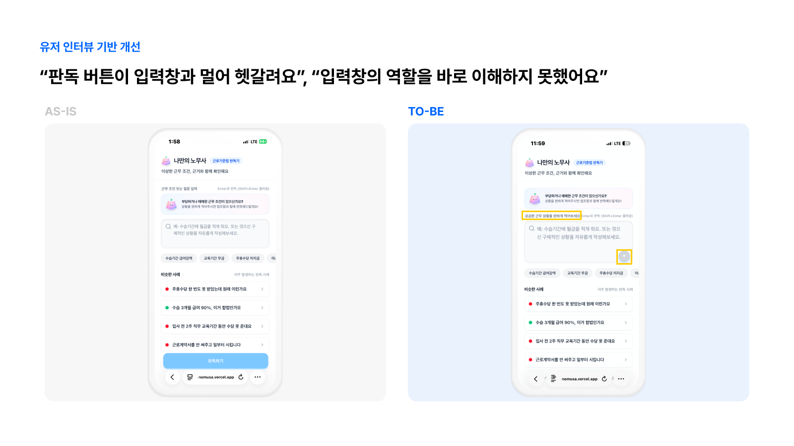
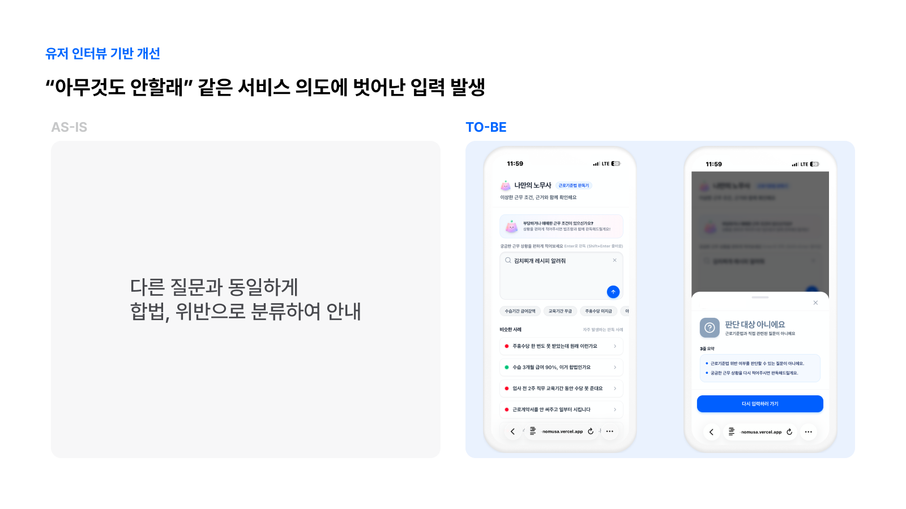
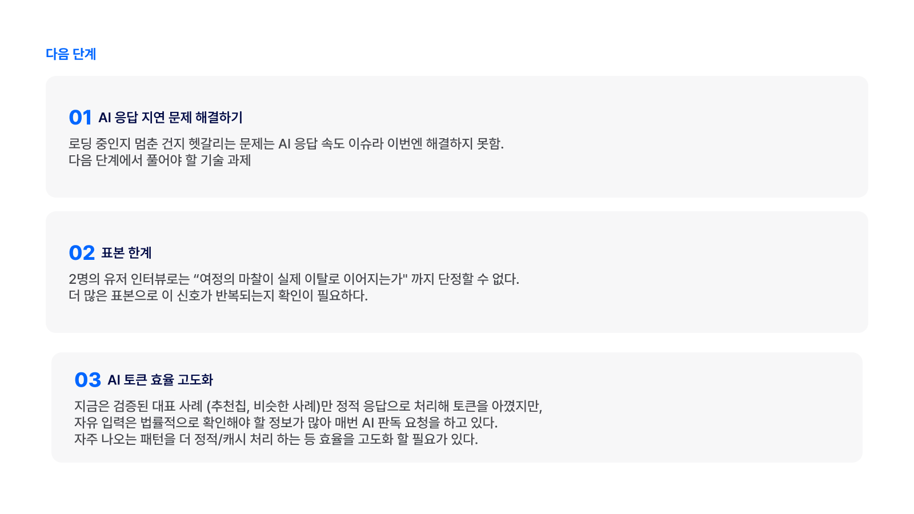
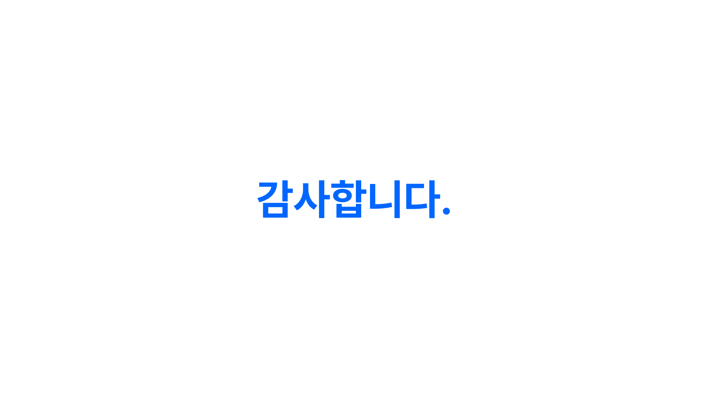

[강동7기 전Z전능 AI PM] 코멘토 청년취업사관학교 DAY 29

## DAY 29 | "나만의 노무사" 발표 자료 제작과 발표

오늘은 3일간 작업했던 "나만의 노무사"를 발표 자료로 정리하고, 실제로 발표까지 진행한 하루였다. 짧은 시간 안에 문제 정의부터 다음 단계까지 다 담아야 해서, 슬라이드를 몇 번 쳐내면서 순서를 다시 잡는 데 시간을 꽤 썼다.

### 표지와 문제 정의부터 다시 정리하다

발표 제목 아래에 "근무 중, 이게 맞나? 싶은 순간 나만의 노무사와 함께 판독해요"라는 한 줄을 넣었다. 3일 동안 기능 단위로만 생각하던 걸 한 문장으로 압축하려니, 이 서비스가 결국 뭘 해결하려는 건지 다시 정리하게 됐다.

문제 정의 슬라이드에는 통계청의 2024년 아르바이트 경험 여부 및 부당처우 실태조사 수치를 그대로 넣었다. 근로계약서 미작성이 34.8%, 임금체불 10.3%, 폭언·인격모독 9.7%, 부당해고 6.1%로 나타난 조사인데, 숫자만 보면 문제가 흔하다는 게 바로 와닿지만 정작 당사자 입장에서는 이게 불법인지 아닌지 판단하기가 쉽지 않다. 그래서 상황을 입력하면 근거 법조항과 함께 바로 확인해주는 서비스를 만들었다는 게 문제 정의 슬라이드의 결론이었다.

### 프로토타입, 화면으로 흐름을 보여주다

프로토타입 슬라이드는 화면 다섯 장을 이어 붙여서 사용 흐름 그대로 보여줬다. 자유 입력으로 판독하는 게 메인 기능이고, 추천칩과 비슷한 사례는 빠르게 확인하고 싶은 사람을 위한 보조 기능이다. 판단이 애매한 카테고리는 추가 질문 한 번을 더 던져서 판독 정확도를 높이도록 했는데, "수습기간 급여 감액" 같은 경우 계약 기간이 1년 이상인지 미만인지에 따라 결론이 달라지기 때문이다. 결과창에는 근거 법조항, 3줄 요약, 지금 할 수 있는 일, 신고처 바로가기와 캡처 가이드를 함께 띄운다. 법조항 옆에 법령 확인일과 원문 링크를 붙여둔 것도 슬라이드에서 짚었는데, 판정 결과만 보여주고 끝나는 게 아니라 그 근거를 사용자가 직접 확인할 수 있게 열어두고 싶었다.

이 다음 순서로는 데모 영상을 재생했다. 발표 대본에도 적어뒀듯, 이 데모는 유저 인터뷰 이후 개선된 버전이라 방금 본 프로토타입 화면과 조금 다르다. 발표 중에는 그 차이를 굳이 짚어주지 않고 청중이 직접 찾아보게 던져뒀는데, 문제 정의 → 프로토타입 → 유저 인터뷰 → 개선이라는 순서로 발표를 구성하면서 자연스럽게 "그 사이에 뭐가 바뀌었을까"라는 질문을 만들 수 있었다.

### 유저 인터뷰에서 나온 것들

인터뷰 인사이트는 긍정·주의·기회 세 갈래로 정리했다. 서비스 목적 자체는 두 사람 다 직관적으로 이해했다는 게 긍정적인 부분이었다. 반면 질문 입력 방식이 직관적이지 않았다는 것, "아무것도 안할래"처럼 의도와 다른 방식으로 사용한 경우가 있었다는 것, 판독하기 버튼이 입력창과 멀어 헷갈렸다는 것은 개선이 필요한 지점으로 분류했다. 체크리스트나 계약 전 확인 기능 같은 사전 예방 아이디어는 지금 당장 반영하기보다 앞으로 검토할 기회로 남겨뒀다.

### 인터뷰를 바로 반영한 개선 두 가지

첫 번째 개선은 입력창 주변이었다. 판독하기 버튼이 입력창과 멀어 헷갈린다는 피드백을 받아, 입력창 바로 위로 "궁금한 근무 상황을 편하게 적어보세요"라는 안내 문구를 옮기고, 판독하기 버튼은 별도 영역으로 두는 대신 입력창 안으로 통합했다. AS-IS와 TO-BE를 나란히 놓고 보니 버튼 하나 옮긴 것뿐인데도 화면이 훨씬 정돈되어 보였다.

두 번째 개선은 예외 처리였다. 개선 전에는 "김치찌개 레시피 알려줘"처럼 서비스 의도에서 벗어난 질문도 다른 질문과 똑같이 합법·위반으로 분류해서 안내하고 있었다. 판단할 수 없는 질문을 억지로 판정해버리는 건 신뢰도를 깎는 일이라, 개선 후에는 "판단 대상 아니에요"라는 안내와 함께 다시 입력하도록 유도하는 흐름으로 바꿨다.

### 다음 단계, 미룬 것과 남은 것

다음 단계는 세 가지로 정리했다. 첫째는 AI 응답 지연 문제다. 로딩 중인 건지 멈춘 건지 구분이 안 된다는 피드백은 이번에 완전히 해결하지 못했고, 다음 기술 과제로 남겨뒀다. 둘째는 표본의 한계다. 2명의 인터뷰만으로는 화면에서 겪은 마찰이 실제 이탈로 이어지는지까지 단정할 수 없어서, 더 많은 표본으로 같은 신호가 반복되는지 확인이 필요하다. 셋째는 AI 토큰 효율 고도화다. 추천칩처럼 검증된 대표 사례는 정적 응답으로 처리해 토큰을 아꼈지만, 자유 입력은 법률적으로 확인할 게 많아 매번 AI 판독을 태우고 있다. 자주 나오는 패턴을 캐싱하는 식으로 효율을 더 높일 여지가 남아 있다.

### 발표를 마치고

발표 자체는 4분이 채 안 되는 짧은 시간이었지만, 3일 동안 만든 기능과 고친 버그, 인터뷰에서 나온 피드백을 순서대로 압축해서 담으려니 슬라이드 구성에 생각보다 손이 많이 갔다. 문제 정의에서 시작해 프로토타입, 인터뷰, 개선, 다음 단계로 이어지는 흐름을 잡아두니 발표 대본을 쓸 때도, 실제로 말할 때도 헤매지 않고 이어갈 수 있었다. 무엇을 만들었는지보다 무엇을 고쳤고 무엇을 남겨뒀는지를 분명히 하는 게 발표에서도 더 설득력 있게 다가온다는 걸 다시 확인한 시간이었다.

### 발표 후 받은 피드백

발표 후 멘토님들과 동료들에게 받은 피드백을 주제별로 정리했다.

**서비스 차별성**
- 피드백: 서비스의 존재 이유와 목적, 그리고 GPT 같은 범용 AI와 비교했을 때의 차별점을 더 명확히 드러내야 한다는 의견이 많았다. "챗GPT보다 뛰어난가?"라는 질문도 직접 받았다.
- 내 생각: 지금은 "합법인지 부당한지 판단해주는 서비스"라는 가치를 슬라이드 한 줄로만 던져뒀는데, 실제 사례·판례 기반으로 유사 사례를 보여주고 서비스가 어디까지 도와줄 수 있는지 범위를 분명히 해야 이 질문에 제대로 답할 수 있을 것 같다.

**신뢰성 확보**
- 피드백: AI 판독 결과만으로는 확신이 서지 않으니 실제 노무사의 코멘트나 유사 사례·판례를 함께 보여주면 좋겠다는 의견, 더 나아가 AI 판독으로 끝내지 말고 필요한 순간엔 실제 노무사와 연결해주는 방향으로 확장하면 좋겠다는 제안도 있었다.
- 내 생각: 결국 같은 곳을 가리키는 피드백이라, 판독으로 끝나는 게 아니라 진짜 필요한 순간엔 사람에게 연결해주는 것도 서비스의 역할일 수 있겠다는 생각이 들었다.

**기능/UI 디테일**
- 피드백: 판독 버튼을 화살표 대신 비행기(전송) 아이콘으로 바꾸면 인지 혼란이 줄 것 같다는 의견, 선택지 카드에 "기타" 입력을 추가해 정해진 선택지 중에서만 고르지 않아도 되게 하면 좋겠다는 의견, 근로계약서 사본을 PDF나 문서로 업로드할 수 있게 하면 좋겠다는 의견을 받았다.
- 내 생각: 셋 다 바로 반영할 수 있는 수준의 개선이라 다음 스프린트에 먼저 처리하면 좋을 것 같다. 특히 문서 업로드는 자유 입력보다 훨씬 정확한 판독으로 이어질 수 있을 것 같다.

**기술 과제 — 응답 지연·토큰 효율**
- 피드백: 응답 지연은 비용을 투자하면 개선 가능한 문제이니 일정 시간 이상 걸릴 때의 타임아웃 UX를 같이 고려하라는 조언, 추론 길이·temperature 조절과 에이전트 역할을 나누는 오케스트레이션으로 토큰 효율을 높일 수 있다는 실전 팁을 받았다.
- 내 생각: 발표에서 "다음 단계"로만 남겨뒀던 두 문제를 실제로 어떻게 풀 수 있는지 힌트를 얻은 셈이라, 다음에 손댈 때는 막연하게 접근하지 않아도 될 것 같다.

**발표 구성**
- 피드백: 서비스를 기획하게 된 실제 경험을 도입부에서 이야기한 점, 타겟(사회초년생)을 명확히 설정한 점, 사용자 테스트를 바탕으로 문제를 풀어가는 과정이 잘 보였다는 점이 좋았다는 평을 받았다.
- 내 생각: 만드는 것 자체보다 왜 만들었고 무엇을 근거로 고쳤는지를 보여주는 방식이 발표에서도 통한다는 걸 다시 한번 느꼈다.

#취업 #부트캠프 #청년취업사관학교 #새싹 #AIPM #DX교육 #AI교육 #실무프로젝트 #실무경험 #취업포트폴리오 #포트폴리오 #전Z전능 #코멘토 #모비니티
